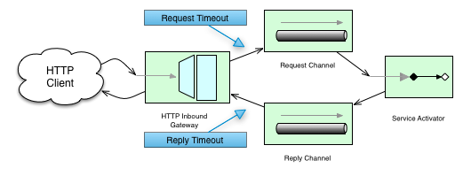
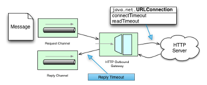

[[http]]
== HTTP Support

Spring Integration's HTTP support allows for the running of HTTP requests and the processing of inbound HTTP requests.
The HTTP support consists of the following gateway implementations: `HttpInboundEndpoint` and `HttpRequestExecutingMessageHandler`.
See also <<./webflux.adoc#webflux,WebFlux Support>>.

You need to include this dependency into your project:

====
.Maven
[source, xml, subs="normal"]
----
<dependency>
    <groupId>org.springframework.integration</groupId>
    <artifactId>spring-integration-http</artifactId>
    <version>{project-version}</version>
</dependency>
----

.Gradle
[source, groovy, subs="normal"]
----
compile "org.springframework.integration:spring-integration-http:{project-version}"
----
====

The `javax.servlet:javax.servlet-api` dependency must be provided on the target Servlet container.

[[http-inbound]]
=== Http Inbound Components

To receive messages over HTTP, you need to use an HTTP inbound channel adapter or an HTTP inbound gateway.
To support the HTTP inbound adapters, they need to be deployed within a servlet container such as https://tomcat.apache.org/[Apache Tomcat] or https://www.eclipse.org/jetty/[Jetty].
The easiest way to do this is to use Spring's https://docs.spring.io/spring/docs/current/javadoc-api/org/springframework/web/context/support/HttpRequestHandlerServlet.html[`HttpRequestHandlerServlet`], by providing the following servlet definition in the `web.xml` file:

====
[source,xml]
----
<servlet>
    <servlet-name>inboundGateway</servlet-name>
    <servlet-class>o.s.web.context.support.HttpRequestHandlerServlet</servlet-class>
</servlet>
----
====

Notice that the servlet name matches the bean name.
For more information on using the `HttpRequestHandlerServlet`, see https://docs.spring.io/spring/docs/current/spring-framework-reference/html/remoting.html[Remoting and web services using Spring], which is part of the Spring Framework Reference documentation.

If you are running within a Spring MVC application, then the aforementioned explicit servlet definition is not necessary.
In that case, the bean name for your gateway can be matched against the URL path as you would for a Spring MVC Controller bean.
For more information, see
https://docs.spring.io/spring/docs/current/spring-framework-reference/web.html#mvc[Web MVC framework], which is part of the Spring Framework Reference documentation.

TIP: For a sample application and the corresponding configuration, see the https://github.com/spring-projects/spring-integration-samples[Spring Integration Samples] repository.
It contains the https://github.com/spring-projects/spring-integration-samples/tree/master/basic/http[HTTP sample] application, which demonstrates Spring Integration's HTTP support.

The following example bean defines an HTTP inbound endpoint:

====
[source,xml]
----
<bean id="httpInbound"
  class="org.springframework.integration.http.inbound.HttpRequestHandlingMessagingGateway">
  <property name="requestChannel" ref="httpRequestChannel" />
  <property name="replyChannel" ref="httpReplyChannel" />
</bean>
----
====

The `HttpRequestHandlingMessagingGateway` accepts a list of `HttpMessageConverter` instances or else relies on a default list.
The converters allow customization of the mapping from `HttpServletRequest` to `Message`.
The default converters encapsulate simple strategies, which (for example) create a `String` message for a `POST` request where the content type starts with `text`.
See the https://docs.spring.io/spring-integration/api/index.html[Javadoc] for full details.
An additional flag (`mergeWithDefaultConverters`) can be set along with the list of custom `HttpMessageConverter` to add the default converters after the custom converters.
By default, this flag is set to `false`, meaning that the custom converters replace the default list.

The message conversion process uses the (optional) `requestPayloadType` property and the incoming `Content-Type` header.
Starting with version 4.3, if a request has no content type header, `application/octet-stream` is assumed, as recommended by `RFC 2616`.
Previously, the body of such messages was ignored.

Spring Integration 2.0 implemented multipart file support.
If the request has been wrapped as a `MultipartHttpServletRequest`, when you use the default converters, that request is converted to a `Message` payload that is a `MultiValueMap` containing values that may be byte arrays, strings, or instances of Spring's `MultipartFile`, depending on the content type of the individual parts.

NOTE: The HTTP inbound endpoint locates a `MultipartResolver` in the context if one has a bean name of `multipartResolver` (the same name expected by Spring's `DispatcherServlet`).
If it does locate that bean, the support for multipart files is enabled on the inbound request mapper.
Otherwise, it fails when it tries to map a multipart file request to a Spring Integration `Message`.
For more on Spring's support for `MultipartResolver`, see the https://docs.spring.io/spring/docs/current/spring-framework-reference/web.html#mvc-multipart[Spring Reference Manual].

[NOTE]
====
If you wish to proxy a `multipart/form-data` to another server, it may be better to keep it in raw form.
To handle this situation, do not add the `multipartResolver` bean to the context.
Configure the endpoint to expect a `byte[]` request, customize the message converters to include a `ByteArrayHttpMessageConverter`, and disable the default multipart converter.
You may need some other converters for the replies.
The following example shows such an arrangement:

[source, xml]
----
<int-http:inbound-gateway
                  channel="receiveChannel"
                  path="/inboundAdapter.htm"
                  request-payload-type="byte[]"
                  message-converters="converters"
                  merge-with-default-converters="false"
                  supported-methods="POST" />

<util:list id="converters">
    <beans:bean class="org.springframework.http.converter.ByteArrayHttpMessageConverter" />
    <beans:bean class="org.springframework.http.converter.StringHttpMessageConverter" />
    <beans:bean class="org.springframework.http.converter.json.MappingJackson2HttpMessageConverter" />
</util:list>
----
====

When you send a response to the client, you have a number of ways to customize the behavior of the gateway.
By default, the gateway acknowledges that the request was received by sending a `200` status code back.
It is possible to customize this response by providing a 'viewName' to be resolved by the Spring MVC `ViewResolver`.
If the gateway should expect a reply to the `Message`, you can set the `expectReply` flag (constructor argument) to cause the gateway to wait for a reply `Message` before creating an HTTP response.
The following example configures a gateway to serve as a Spring MVC Controller with a view name:

[source,xml]
----
<bean id="httpInbound"
  class="org.springframework.integration.http.inbound.HttpRequestHandlingController">
  <constructor-arg value="true" /> <!-- indicates that a reply is expected -->
  <property name="requestChannel" ref="httpRequestChannel" />
  <property name="replyChannel" ref="httpReplyChannel" />
  <property name="viewName" value="jsonView" />
  <property name="supportedMethodNames" >
    <list>
      <value>GET</value>
      <value>DELETE</value>
    </list>
  </property>
</bean>
----

Because of the `constructor-arg` value of `true`, it waits for a reply.
The preceding example also shows how to customize the HTTP methods accepted by the gateway, which are `POST` and `GET` by default.

The reply message is available in the model map.
By default, the key for that map entry is 'reply', but you can override this default by setting the 'replyKey' property on the endpoint's configuration.

[[http-validation]]
==== Payload Validation

Starting with version 5.2, the HTTP inbound endpoints can be supplied with a `Validator` to check a payload before sending into the channel.
This payload is already a result of conversion and extraction after `payloadExpression` to narrow a validation scope in regards to the valuable data.
The validation failure handling is fully the same what we have in Spring MVC https://docs.spring.io/spring/docs/current/spring-framework-reference/web.html#mvc-exceptionhandlers[Error Handling].

[[http-outbound]]
=== HTTP Outbound Components

This section describes Spring Integration's HTTP outbound components.

==== Using `HttpRequestExecutingMessageHandler`

To configure the `HttpRequestExecutingMessageHandler`, write a bean definition similar to the following:

====
[source,xml]
----
<bean id="httpOutbound"
  class="org.springframework.integration.http.outbound.HttpRequestExecutingMessageHandler">
  <constructor-arg value="http://localhost:8080/example" />
  <property name="outputChannel" ref="responseChannel" />
</bean>
----
====

This bean definition runs HTTP requests by delegating to a `RestTemplate`.
That template, in turn, delegates to a list of `HttpMessageConverter` instances to generate the HTTP request body from the `Message` payload.
You can configure those converters as well as the `ClientHttpRequestFactory` instance to use, as the following example shows:

====
[source,xml]
----
<bean id="httpOutbound"
  class="org.springframework.integration.http.outbound.HttpRequestExecutingMessageHandler">
  <constructor-arg value="http://localhost:8080/example" />
  <property name="outputChannel" ref="responseChannel" />
  <property name="messageConverters" ref="messageConverterList" />
  <property name="requestFactory" ref="customRequestFactory" />
</bean>
----
====

By default, the HTTP request is generated by using an instance of `SimpleClientHttpRequestFactory`, which uses the JDK `HttpURLConnection`.
Use of the Apache Commons HTTP Client is also supported through `CommonsClientHttpRequestFactory`, which you can inject (as shown earlier).

NOTE: For the outbound gateway, the reply message produced by the gateway contains all the message headers that are present in the request message.

==== Using Cookies

Basic cookie support is provided by the `transfer-cookies` attribute on the outbound gateway.
When set to `true` (the default is `false`), a `Set-Cookie` header received from the server in a response is converted to `Cookie` in the reply message.
This header is then used on subsequent sends.
This enables simple stateful interactions, such as the following:

`...->logonGateway->...->doWorkGateway->...->logoffGateway->...`

If `transfer-cookies` is `false`, any `Set-Cookie` header received remains as `Set-Cookie` in the reply message and is dropped on subsequent sends.

[NOTE]
.Empty Response Bodies
=====
HTTP is a request-response protocol.
However, the response may not have a body, only headers.
In this case, the `HttpRequestExecutingMessageHandler` produces a reply `Message` with the payload being an `org.springframework.http.ResponseEntity`, regardless of any provided `expected-response-type`.
According to the https://www.w3.org/Protocols/rfc2616/rfc2616-sec10.html[HTTP RFC Status Code Definitions], there are many statuses that mandate that a response must not contain a message-body (for example, `204 No Content`).
There are also cases where calls to the same URL might or might not return a response body.
For example, the first request to an HTTP resource returns content, but the second does not (returning a `304 Not Modified`).
In all cases, however, the `http_statusCode` message header is populated.
This can be used in some routing logic after the HTTP outbound gateway.
You could also use a`<payload-type-router/>` to route messages with a `ResponseEntity` to a different flow than that used for responses with a body.
=====
[NOTE]
.expected-response-type
=====
Further to the preceding note about empty response bodies, if a response does contain a body, you must provide an appropriate `expected-response-type` attribute or, again, you receive a `ResponseEntity` with no body.
The `expected-response-type` must be compatible with the (configured or default) `HttpMessageConverter` instances and the `Content-Type` header in the response.
This can be an abstract class or even an interface (such as `java.io.Serializable` when you use Java serialization and `Content-Type: application/x-java-serialized-object`).
=====

[[http-namespace]]
=== HTTP Namespace Support

Spring Integration provides an `http` namespace and the corresponding schema definition.
To include it in your configuration, provide the following namespace declaration in your application context configuration file:

====
[source,xml]
----
<?xml version="1.0" encoding="UTF-8"?>
<beans xmlns="http://www.springframework.org/schema/beans"
  xmlns:xsi="http://www.w3.org/2001/XMLSchema-instance"
  xmlns:int="http://www.springframework.org/schema/integration"
  xmlns:int-http="http://www.springframework.org/schema/integration/http"
  xsi:schemaLocation="
    http://www.springframework.org/schema/beans
    https://www.springframework.org/schema/beans/spring-beans.xsd
    http://www.springframework.org/schema/integration
    https://www.springframework.org/schema/integration/spring-integration.xsd
    http://www.springframework.org/schema/integration/http
    https://www.springframework.org/schema/integration/http/spring-integration-http.xsd">
    ...
</beans>
----
====

==== Inbound

The XML namespace provides two components for handling HTTP inbound requests: `inbound-channel-adapter` and `inbound-gateway`.
In order to process requests without returning a dedicated response, use the `inbound-channel-adapter`.
The following example shows how to configure one:

====
[source,xml]
----
<int-http:inbound-channel-adapter id="httpChannelAdapter" channel="requests"
    supported-methods="PUT, DELETE"/>
----
====

To process requests that do expect a response, use an `inbound-gateway`.
The following example shows how to configure one:

====
[source,xml]
----
<int-http:inbound-gateway id="inboundGateway"
    request-channel="requests"
    reply-channel="responses"/>
----
====

[[http-request-mapping]]
==== Request Mapping Support

NOTE: Spring Integration 3.0 improved the REST support by introducing the https://docs.spring.io/spring-integration/api/org/springframework/integration/http/inbound/IntegrationRequestMappingHandlerMapping.html[`IntegrationRequestMappingHandlerMapping`].
The implementation relies on the enhanced REST support provided by Spring Framework 3.1 or higher.

The parsing of the HTTP inbound gateway or the HTTP inbound channel adapter registers an `integrationRequestMappingHandlerMapping` bean of type https://docs.spring.io/spring-integration/api/org/springframework/integration/http/inbound/IntegrationRequestMappingHandlerMapping.html[`IntegrationRequestMappingHandlerMapping`], in case one is not yet registered.
This particular implementation of the https://docs.spring.io/spring/docs/current/javadoc-api/org/springframework/web/servlet/HandlerMapping.html[`HandlerMapping`] delegates its logic to https://docs.spring.io/spring/docs/current/javadoc-api/org/springframework/web/servlet/mvc/method/RequestMappingInfoHandlerMapping.html[`RequestMappingInfoHandlerMapping`].
The implementation provides functionality similar to the https://docs.spring.io/spring/docs/current/javadoc-api/org/springframework/web/bind/annotation/RequestMapping.html[`org.springframework.web.bind.annotation.RequestMapping`] annotation in Spring MVC.

NOTE: For more information, see https://docs.spring.io/spring/docs/current/spring-framework-reference/web.html#mvc-ann-requestmapping[Mapping Requests With `@RequestMapping`].

For this purpose, Spring Integration 3.0 introduces the `<request-mapping>` element.
You can add this optional element to `<http:inbound-channel-adapter>` and `<http:inbound-gateway>`.
It works in conjunction with the `path` and `supported-methods` attributes.
The following example shows how to configure it on an inbound gateway:

====
[source,xml]
----
<inbound-gateway id="inboundController"
    request-channel="requests"
    reply-channel="responses"
    path="/foo/{fooId}"
    supported-methods="GET"
    view-name="foo"
    error-code="oops">
   <request-mapping headers="User-Agent"
     params="myParam=myValue"
     consumes="application/json"
     produces="!text/plain"/>
</inbound-gateway>
----
====

Based on the preceding configuration, the namespace parser creates an instance of the `IntegrationRequestMappingHandlerMapping` (if none exists) and an `HttpRequestHandlingController` bean and associates with it an instance of https://docs.spring.io/spring-integration/api/org/springframework/integration/http/inbound/RequestMapping.html[`RequestMapping`].
This `RequestMapping` instance is, in turn, converted to the Spring MVC https://docs.spring.io/spring/docs/current/javadoc-api/org/springframework/web/servlet/mvc/method/RequestMappingInfo.html[`RequestMappingInfo`].

The `<request-mapping>` element provides the following attributes:

* `headers`
* `params`
* `consumes`
* `produces`

With the `path` and `supported-methods` attributes of the `<http:inbound-channel-adapter>` or the `<http:inbound-gateway>`, `<request-mapping>` attributes translate directly into the respective options provided by the `org.springframework.web.bind.annotation.RequestMapping` annotation in Spring MVC.

The `<request-mapping>` element lets you configure several Spring Integration HTTP inbound endpoints to the same `path` (or even the same `supported-methods`) and lets you provide different downstream message flows based on incoming HTTP requests.

Alternatively, you can also declare only one HTTP inbound endpoint and apply routing and filtering logic within the Spring Integration flow to achieve the same result.
This lets you get the `Message` into the flow as early as possibly.
The following example shows how to do so:

====
[source,xml]
----
<int-http:inbound-gateway request-channel="httpMethodRouter"
    supported-methods="GET,DELETE"
    path="/process/{entId}"
    payload-expression="#pathVariables.entId"/>

<int:router input-channel="httpMethodRouter" expression="headers.http_requestMethod">
    <int:mapping value="GET" channel="in1"/>
    <int:mapping value="DELETE" channel="in2"/>
</int:router>

<int:service-activator input-channel="in1" ref="service" method="getEntity"/>

<int:service-activator input-channel="in2" ref="service" method="delete"/>
----
====

For more information regarding handler mappings, see https://docs.spring.io/spring/docs/current/spring-framework-reference/web.html[the Spring Framework Web Servlet documentation] or https://docs.spring.io/spring/docs/current/spring-framework-reference/web-reactive.html[the Spring Framework Web Reactive documentation].

[[http-cors]]
==== Cross-origin Resource Sharing (CORS) Support

Starting with version 4.2, you can configure the `<http:inbound-channel-adapter>` and `<http:inbound-gateway>` with a `<cross-origin>` element.
It represents the same options as Spring MVC's `@CrossOrigin` for `@Controller` annotations and allows the configuration of cross-origin resource sharing (CORS) for Spring Integration HTTP endpoints:

* `origin`: List of allowed origins.
The `pass:[*]` means that all origins are allowed.
These values are placed in the `Access-Control-Allow-Origin` header of both the pre-flight and actual responses.
The default value is `pass:[*]`.
* `allowed-headers`: Indicates which request headers can be used during the actual request.
The `pass:[*]` means that all headers requested by the client are allowed.
This property controls the value of the pre-flight response's `Access-Control-Allow-Headers` header.
The default value is `pass:[*]`.
* `exposed-headers`: List of response headers that the user-agent lets the client access.
This property controls the value of the actual response's `Access-Control-Expose-Headers` header.
* `method`: The HTTP request methods to allow: `GET`, `POST`, `HEAD`, `OPTIONS`, `PUT`, `PATCH`, `DELETE`, `TRACE`.
Methods specified here overrides those in `supported-methods`.
* `allow-credentials`: Set to `true` if the the browser should include any cookies associated to the domain of the request or `false` if it should not.
An empty string ("") means undefined.
If `true`, the pre-flight response includes the `Access-Control-Allow-Credentials=true` header.
The default value is `true`.
* `max-age`: Controls the cache duration for pre-flight responses.
Setting this to a reasonable value can reduce the number of pre-flight request-response interactions required by the browser.
This property controls the value of the `Access-Control-Max-Age` header in the pre-flight response.
A value of `-1` means undefined.
The default value is 1800 seconds (30 minutes).

The CORS Java Configuration is represented by the `org.springframework.integration.http.inbound.CrossOrigin` class, instances of which can be injected into the `HttpRequestHandlingEndpointSupport` beans.

[[http-response-statuscode]]
==== Response Status Code

Starting with version 4.1, you can configure the `<http:inbound-channel-adapter>` with a `status-code-expression` to override the default `200 OK` status.
The expression must return an object that can be converted to an `org.springframework.http.HttpStatus` enum value.
The `evaluationContext` has a `BeanResolver` and, starting with version 5.1, is supplied with the `RequestEntity<?>` as root object.
An example might be to resolve, at runtime, some scoped bean that returns a status code value.
However, most likely, it is set to a fixed value such as `status-code=expression="204"` (No Content), or `status-code-expression="T(org.springframework.http.HttpStatus).NO_CONTENT"`.
By default, `status-code-expression` is null, meaning that the normal '200 OK' response status is returned.
Using the `RequestEntity<?>` as root object, the status code can be conditional e.g. on the request method, some header, URI content or even request body.
The following example shows how to set the status code to `ACCEPTED`:

====
[source,xml]
----
<http:inbound-channel-adapter id="inboundController"
       channel="requests" view-name="foo" error-code="oops"
       status-code-expression="T(org.springframework.http.HttpStatus).ACCEPTED">
   <request-mapping headers="BAR"/>
</http:inbound-channel-adapter>
----
====

The `<http:inbound-gateway>` resolves the 'status code' from the `http_statusCode` header of the reply `Message`.
Starting with version 4.2, the default response status code when no reply is received within the `reply-timeout` is `500 Internal Server Error`.
There are two ways to modify this behavior:

* Add a `reply-timeout-status-code-expression`.
This has the same semantics as the `status-code-expression` on the inbound adapter.
* Add an `error-channel` and return an appropriate message with an HTTP status code header, as the following example shows:
+
====
[source, xml]
----
<int:chain input-channel="errors">
    <int:header-enricher>
        <int:header name="http_statusCode" value="504" />
    </int:header-enricher>
    <int:transformer expression="payload.failedMessage" />
</int:chain>
----
====

The payload of the `ErrorMessage` is a `MessageTimeoutException`.
It must be transformed to something that can be converted by the gateway, such as a `String`.
A good candidate is the exception's message property, which is the value used when you use the `expression` technique.

If the error flow times out after a main flow timeout, `500 Internal Server Error` is returned, or, if the `reply-timeout-status-code-expression` is present, it is evaluated.

NOTE: Previously, the default status code for a timeout was `200 OK`.
To restore that behavior, set `reply-timeout-status-code-expression="200"`.

==== URI Template Variables and Expressions

By using the `path` attribute in conjunction with the `payload-expression` attribute and the `header` element, you have a high degree of flexibility for mapping inbound request data.

In the following example configuration, an inbound channel adapter is configured to accept requests using the following URI:

====
[source]
----
/first-name/{firstName}/last-name/{lastName}
----
====

When you use the `payload-expression` attribute, the `{firstName}` URI template variable maps to be the `Message` payload, while the `{lastName}` URI template variable maps to the `lname` message header, as defined in the following example:

====
[source,xml]
----
<int-http:inbound-channel-adapter id="inboundAdapterWithExpressions"
    path="/first-name/{firstName}/last-name/{lastName}"
    channel="requests"
    payload-expression="#pathVariables.firstName">
    <int-http:header name="lname" expression="#pathVariables.lastName"/>
</int-http:inbound-channel-adapter>
----
====

For more information about URI template variables, see https://docs.spring.io/spring/docs/current/spring-framework-reference/web.html#mvc-ann-requestmapping-uri-templates[uri template patterns] in the Spring Reference Manual.

Since Spring Integration 3.0, in addition to the existing `#pathVariables` and `#requestParams` variables being available in payload and header expressions, we added other useful expression variables:

* `#requestParams`: The `MultiValueMap` from the `ServletRequest` `parameterMap`.
* `#pathVariables`: The `Map` from URI Template placeholders and their values.
* `#matrixVariables`: The `Map` of `MultiValueMap` according to the https://docs.spring.io/spring/docs/current/spring-framework-reference/web.html#mvc-ann-matrix-variables[Spring MVC Specification].
Note that `#matrixVariables` requires Spring MVC 3.2 or higher.
* `#requestAttributes`: The `org.springframework.web.context.request.RequestAttributes` associated with the current request.
* `#requestHeaders`: The `org.springframework.http.HttpHeaders` object from the current request.
* `#cookies`: The `Map<String, Cookie>` of `javax.servlet.http.Cookie` instances from the current request.

Note that all these values (and others) can be accessed within expressions in the downstream message flow through the `ThreadLocal` `org.springframework.web.context.request.RequestAttributes` variable, if that message flow is single-threaded and lives within the request thread.
The following example configures a transformer that uses an `expression` attribute:

====
[source,xml]
----
<int-:transformer
    expression="T(org.springframework.web.context.request.RequestContextHolder).
                  requestAttributes.request.queryString"/>

----
====

==== Outbound

To configure the outbound gateway, you can use the namespace support.
The following code snippet shows the available configuration options for an outbound HTTP gateway:

====
[source,xml]
----
<int-http:outbound-gateway id="example"
    request-channel="requests"
    url="http://localhost/test"
    http-method="POST"
    extract-request-payload="false"
    expected-response-type="java.lang.String"
    charset="UTF-8"
    request-factory="requestFactory"
    reply-timeout="1234"
    reply-channel="replies"/>
----
====

Most importantly, notice that the 'http-method' and 'expected-response-type' attributes are provided.
Those are two of the most commonly configured values.
The default `http-method` is `POST`, and the default response type is null.
With a null response type, the payload of the reply `Message` contains the `ResponseEntity`, as long as its HTTP status is a success (non-successful status codes throw exceptions).
If you expect a different type, such as a `String`, provide that as a fully-qualified class name (`java.lang.String` in the preceding example).
See also the note about empty response bodies in <<http-outbound>>.

IMPORTANT: Beginning with Spring Integration 2.1, the `request-timeout` attribute of the HTTP outbound gateway was renamed to `reply-timeout` to better reflect its intent.

[IMPORTANT]
=====
Since Spring Integration 2.2, Java serialization over HTTP is no longer enabled by default.
Previously, when setting the `expected-response-type` attribute to a `Serializable` object, the `Accept` header was not properly set up.
Since Spring Integration 2.2, the `SerializingHttpMessageConverter` has now been updated to set the `Accept` header to `application/x-java-serialized-object`.

However, because this could cause incompatibility with existing applications, it was decided to no longer automatically add this converter to the HTTP endpoints.
If you wish to use Java serialization, you can add the `SerializingHttpMessageConverter` to the appropriate endpoints, by using the `message-converters` attribute (when you use XML configuration) or by using the `setMessageConverters()` method (in Java configuration).
Alternatively, you may wish to consider using JSON instead, which is enabled by having https://github.com/FasterXML/jackson[the Jackson library] on the classpath.
=====

Beginning with Spring Integration 2.2, you can also determine the HTTP method dynamically by using SpEL and the `http-method-expression` attribute.
Note that this attribute is mutually exclusive with `http-method`.
You can also use the `expected-response-type-expression` attribute instead of `expected-response-type` and provide any valid SpEL expression that determines the type of the response.
The following configuration example uses `expected-response-type-expression`:

====
[source,xml]
----
<int-http:outbound-gateway id="example"
    request-channel="requests"
    url="http://localhost/test"
    http-method-expression="headers.httpMethod"
    extract-request-payload="false"
    expected-response-type-expression="payload"
    charset="UTF-8"
    request-factory="requestFactory"
    reply-timeout="1234"
    reply-channel="replies"/>
----
====

If your outbound adapter is to be used in a unidirectional way, you can use an `outbound-channel-adapter` instead.
This means that a successful response executes without sending any messages to a reply channel.
In the case of any non-successful response status code, it throws an exception.
The configuration looks very similar to the gateway, as the following example shows:

====
[source,xml]
----
<int-http:outbound-channel-adapter id="example"
    url="http://localhost/example"
    http-method="GET"
    channel="requests"
    charset="UTF-8"
    extract-payload="false"
    expected-response-type="java.lang.String"
    request-factory="someRequestFactory"
    order="3"
    auto-startup="false"/>
----
====

[NOTE]
=====
To specify the URL, you can use either the 'url' attribute or the 'url-expression' attribute.
The 'url' attribute takes a simple string (with placeholders for URI variables, as described below).
The 'url-expression' is a SpEL expression, with the `Message` as the root object, which enables dynamic urls.
The URL that results from the expression evaluation can still have placeholders for URI variables.

In previous releases, some users used the place holders to replace the entire URL with a URI variable.
Changes in Spring 3.1 can cause some issues with escaped characters, such as '?'.
For this reason, we recommend that, if you wish to generate the URL entirely at runtime, you use the 'url-expression' attribute.
=====

[[mapping-uri-variables]]
==== Mapping URI Variables

If your URL contains URI variables, you can map them by using the `uri-variable` element.
This element is available for the HTTP outbound gateway and the HTTP outbound channel adapter.
The following example maps the `zipCode` URI variable to an expression:

====
[source,xml]
----
<int-http:outbound-gateway id="trafficGateway"
    url="https://local.yahooapis.com/trafficData?appid=YdnDemo&amp;zip={zipCode}"
    request-channel="trafficChannel"
    http-method="GET"
    expected-response-type="java.lang.String">
    <int-http:uri-variable name="zipCode" expression="payload.getZip()"/>
</int-http:outbound-gateway>
----
====

The `uri-variable` element defines two attributes: `name` and `expression`.
The `name` attribute identifies the name of the URI variable, while the `expression` attribute is used to set the actual value.
By using the `expression` attribute, you can leverage the full power of the Spring Expression Language (SpEL), which gives you full dynamic access to the message payload and the message headers.
For example, in the preceding configuration, the `getZip()` method is invoked on the payload object of the `Message` and the result of that method is used as the value of the URI variable named 'zipCode'.

Since Spring Integration 3.0, HTTP outbound endpoints support the `uri-variables-expression` attribute to specify an `expression` that should be evaluated, resulting in a `Map` of all URI variable placeholders within the URL template.
It provides a mechanism whereby you can use different variable expressions, based on the outbound message.
This attribute is mutually exclusive with the `<uri-variable/>` element.
The following example shows how to use the `uri-variables-expression` attribute:

====
[source,xml]
----
<int-http:outbound-gateway
     url="https://foo.host/{foo}/bars/{bar}"
     request-channel="trafficChannel"
     http-method="GET"
     uri-variables-expression="@uriVariablesBean.populate(payload)"
     expected-response-type="java.lang.String"/>
----
====

`uriVariablesBean` might be defined as follows:

====
[source,java]
----
public class UriVariablesBean {
    private static final ExpressionParser EXPRESSION_PARSER = new SpelExpressionParser();

    public Map<String, ?> populate(Object payload) {
        Map<String, Object> variables = new HashMap<String, Object>();
        if (payload instanceOf String.class)) {
            variables.put("foo", "foo"));
        }
        else {
            variables.put("foo", EXPRESSION_PARSER.parseExpression("headers.bar"));
        }
        return variables;
    }

}
----
====

NOTE: The `uri-variables-expression` must evaluate to a `Map`.
The values of the `Map` must be instances of `String` or `Expression`.
This `Map` is provided to an `ExpressionEvalMap` for further resolution of URI variable placeholders by using those expressions in the context of the outbound `Message`.

IMPORTANT
====
The `uriVariablesExpression` property provides a very powerful mechanism for evaluating URI variables.
We anticipate that people mostly use simple expressions, such as the preceding example.
However, you can also configure something such as `"@uriVariablesBean.populate(#root)"` with an expression in the returned map being `variables.put("thing1", EXPRESSION_PARSER.parseExpression(message.getHeaders().get("thing2", String.class)));`, where the expression is dynamically provided in the message header named `thing2`.
Since the header may come from an untrusted source, the HTTP outbound endpoints use `SimpleEvaluationContext` when evaluating these expressions.
The `SimpleEvaluationContext` uses only a subset of SpEL features.
If you trust your message sources and wish to use the restricted SpEL constructs, set the `trustedSpel` property of the outbound endpoint to `true`.
====

You can achieve scenarios that need to supply a dynamic set of URI variables on a per-message basis by using a custom `url-expression` and some utilities for building and encoding URL parameters.
The following example shows how to do so:

====
[source,xml]
----
url-expression="T(org.springframework.web.util.UriComponentsBuilder)
                           .fromHttpUrl('https://HOST:PORT/PATH')
                           .queryParams(payload)
                           .build()
                           .toUri()"
----
====

The `queryParams()` method expects a `MultiValueMap<String, String>` as an argument, so you can build a real set of URL query parameters in advance, before performing the request.

The whole `queryString` can also be presented as a `uri-variable`, as the following example shows:

====
[source,xml]
----
<int-http:outbound-gateway id="proxyGateway" request-channel="testChannel"
              url="http://testServer/test?{queryString}">
    <int-http:uri-variable name="queryString" expression="'a=A&amp;b=B'"/>
</int-http:outbound-gateway>
----
====

In this case, you must manually provide the URL encoding.
For example, you can use the `org.apache.http.client.utils.URLEncodedUtils#format()` for this purpose.
As mentioned earlier, a manually built `MultiValueMap<String, String>` can be converted to the the `List<NameValuePair>` `format()` method argument by using the following Java Streams snippet:

====
[source,java]
----
List<NameValuePair> nameValuePairs =
    params.entrySet()
            .stream()
            .flatMap(e -> e
                    .getValue()
                    .stream()
                    .map(v -> new BasicNameValuePair(e.getKey(), v)))
            .collect(Collectors.toList());
----
====

[[http-uri-encoding]]
==== Controlling URI Encoding

By default, the URL string is encoded (see https://docs.spring.io/spring/docs/current/javadoc-api/org/springframework/web/util/UriComponentsBuilder.html[`UriComponentsBuilder`]) to the URI object before sending the request.
In some scenarios with a non-standard URI (such as the RabbitMQ REST API), it is undesirable to perform the encoding.
The `<http:outbound-gateway/>` and `<http:outbound-channel-adapter/>` provide an `encoding-mode` attribute.
To disable encoding the URL, set this attribute to `NONE` (by default, it is `TEMPLATE_AND_VALUES`).
If you wish to partially encode some of the URL, use an `expression` within a `<uri-variable/>`, as the following example shows:

====
[source,xml]
----
<http:outbound-gateway url="https://somehost/%2f/fooApps?bar={param}" encoding-mode="NONE">
          <http:uri-variable name="param"
            expression="T(org.apache.commons.httpclient.util.URIUtil)
                                             .encodeWithinQuery('Hello World!')"/>
</http:outbound-gateway>
----
====

With Java DSL this option can be controlled by the `BaseHttpMessageHandlerSpec.encodingMode()` option.
The same configuration applies for similar outbound components in the <<./webflux.adoc#webflux,WebFlux module>> and <<./ws.adoc#ws,Web Services module>>.
For much sophisticated scenarios it is recommended to configure an `UriTemplateHandler` on the externally provided `RestTemplate`; or in case of WebFlux - `WebClient` with it `UriBuilderFactory`.

[[http-java-config]]
=== Configuring HTTP Endpoints with Java

The following example shows how to configure an inbound gateway with Java:

.Inbound Gateway Using Java Configuration
====
[source, java]
----
@Bean
public HttpRequestHandlingMessagingGateway inbound() {
    HttpRequestHandlingMessagingGateway gateway =
        new HttpRequestHandlingMessagingGateway(true);
    gateway.setRequestMapping(mapping());
    gateway.setRequestPayloadType(String.class);
    gateway.setRequestChannelName("httpRequest");
    return gateway;
}

@Bean
public RequestMapping mapping() {
    RequestMapping requestMapping = new RequestMapping();
    requestMapping.setPathPatterns("/foo");
    requestMapping.setMethods(HttpMethod.POST);
    return requestMapping;
}
----
====

The following example shows how to configure an inbound gateway with the Java DSL:

.Inbound Gateway Using the Java DSL
====
[source, java]
----
@Bean
public IntegrationFlow inbound() {
    return IntegrationFlows.from(Http.inboundGateway("/foo")
            .requestMapping(m -> m.methods(HttpMethod.POST))
            .requestPayloadType(String.class))
        .channel("httpRequest")
        .get();
}
----
====

The following example shows how to configure an outbound gateway with Java:

.Outbound Gateway Using Java Configuration
====
[source, java]
----
@ServiceActivator(inputChannel = "httpOutRequest")
@Bean
public HttpRequestExecutingMessageHandler outbound() {
    HttpRequestExecutingMessageHandler handler =
        new HttpRequestExecutingMessageHandler("http://localhost:8080/foo");
    handler.setHttpMethod(HttpMethod.POST);
    handler.setExpectedResponseType(String.class);
    return handler;
}
----
====

The following example shows how to configure an outbound gateway with the Java DSL:

.Outbound Gateway Using the Java DSL
====
[source, java]
----
@Bean
public IntegrationFlow outbound() {
    return IntegrationFlows.from("httpOutRequest")
        .handle(Http.outboundGateway("http://localhost:8080/foo")
            .httpMethod(HttpMethod.POST)
            .expectedResponseType(String.class))
        .get();
}
----
====

[[http-timeout]]
=== Timeout Handling

In the context of HTTP components, there are two timing areas that have to be considered:

* Timeouts when interacting with Spring Integration Channels
* Timeouts when interacting with a remote HTTP server

The components interact with message channels, for which timeouts can be specified.
For example, an HTTP Inbound Gateway forwards messages received from connected HTTP Clients to a message channel (which uses a request timeout) and consequently the HTTP Inbound Gateway receives a reply message from the reply channel (which uses a reply timeout) that is used to generate the HTTP Response.
The following illustration offers a visual explanation:

.How timeout settings apply to an HTTP Inbound Gateway

For outbound endpoints, we need to consider how timing works while interacting with the remote server.
The following image shows this scenario:

.How timeout settings apply to an HTTP Outbound Gateway

//TODO These images are too small, and the text within them is much too small.

You may want to configure the HTTP related timeout behavior, when making active HTTP requests by using the HTTP outbound gateway or the HTTP outbound channel adapter.
In those instances, these two components use Spring's https://docs.spring.io/spring/docs/current/javadoc-api/org/springframework/web/client/RestTemplate.html[`RestTemplate`] support to execute HTTP requests.

To configure timeouts for the HTTP outbound gateway and the HTTP outbound channel adapter, you can either reference a `RestTemplate` bean directly (by using the `rest-template` attribute) or you can provide a reference to a https://docs.spring.io/spring/docs/current/javadoc-api/org/springframework/http/client/ClientHttpRequestFactory.html[`ClientHttpRequestFactory`] bean (by using the `request-factory` attribute).
Spring provides the following implementations of the `ClientHttpRequestFactory` interface:

* https://docs.spring.io/spring/docs/current/javadoc-api/org/springframework/http/client/SimpleClientHttpRequestFactory.html[`SimpleClientHttpRequestFactory`]: Uses standard J2SE facilities for making HTTP Requests
* https://docs.spring.io/spring/docs/current/javadoc-api/org/springframework/http/client/HttpComponentsClientHttpRequestFactory.html[`HttpComponentsClientHttpRequestFactory`]: Uses https://hc.apache.org/httpcomponents-client-ga/[Apache HttpComponents HttpClient] (since Spring 3.1)

If you do not explicitly configure the `request-factory` or `rest-template` attribute, a default `RestTemplate` (which uses a `SimpleClientHttpRequestFactory`) is instantiated.

[NOTE]
=====
With some JVM implementations, the handling of timeouts by the `URLConnection` class may not be consistent.

For example, from the Java™ Platform, Standard Edition 6 API Specification on `setConnectTimeout`:

[quote]
Some non-standard implementation of this method may ignore the specified timeout.
To see the connect timeout set, please call getConnectTimeout().

If you have specific needs, you should test your timeouts.
Consider using the `HttpComponentsClientHttpRequestFactory`, which, in turn, uses https://hc.apache.org/httpcomponents-client-ga/[Apache HttpComponents HttpClient] rather than relying on implementations provided by a JVM.
=====

IMPORTANT: When you use the Apache HttpComponents HttpClient with a pooling connection manager, you should be aware that, by default, the connection manager creates no more than two concurrent connections per given route and no more than 20 connections in total.
For many real-world applications, these limits may prove to be too constraining.
See the https://hc.apache.org/httpcomponents-client-ga/[Apache documentation] for information about configuring this important component.

The following example configures an HTTP outbound gateway by using a `SimpleClientHttpRequestFactory` that is configured with connect and read timeouts of 5 seconds, respectively:

====
[source,xml]
----
<int-http:outbound-gateway url="https://samples.openweathermap.org/data/2.5/weather?q={city}"
                           http-method="GET"
                           expected-response-type="java.lang.String"
                           request-factory="requestFactory"
                           request-channel="requestChannel"
                           reply-channel="replyChannel">
    <int-http:uri-variable name="city" expression="payload"/>
</int-http:outbound-gateway>

<bean id="requestFactory"
      class="org.springframework.http.client.SimpleClientHttpRequestFactory">
    <property name="connectTimeout" value="5000"/>
    <property name="readTimeout"    value="5000"/>
</bean>
----
====

_HTTP Outbound Gateway_

For the _HTTP Outbound Gateway_, the XML Schema defines only the _reply-timeout_.
The _reply-timeout_ maps to the _sendTimeout_ property of the _org.springframework.integration.http.outbound.HttpRequestExecutingMessageHandler_ class.
More precisely, the property is set on the extended `AbstractReplyProducingMessageHandler` class, which ultimately sets the property on the `MessagingTemplate`.

The value of the _sendTimeout_ property defaults to "-1" and will be applied to the connected `MessageChannel`.
This means, that depending on the implementation, the Message Channel's _send_ method may block indefinitely.
Furthermore, the _sendTimeout_ property is only used, when the actual MessageChannel implementation has a blocking send (such as 'full' bounded QueueChannel).

==== HTTP Inbound Gateway

For the HTTP inbound gateway, the XML Schema defines the `request-timeout` attribute, which is used to set the `requestTimeout` property on the `HttpRequestHandlingMessagingGateway` class (on the extended `MessagingGatewaySupport` class).
You can also use the `reply-timeout` attribute to map to the `replyTimeout` property on the same class.

The default for both timeout properties is `1000ms` (one thousand milliseconds or one second).
Ultimately, the `request-timeout` property is used to set the `sendTimeout` on the `MessagingTemplate` instance.
The `replyTimeout` property, on the other hand, is used to set the `receiveTimeout` property on the `MessagingTemplate` instance.

TIP: To simulate connection timeouts, you can connect to a non-routable IP address, such as 10.255.255.10.

[[http-proxy]]
=== HTTP Proxy configuration

If you are behind a proxy and need to configure proxy settings for HTTP outbound adapters or gateways, you can apply one of two approaches.
In most cases, you can rely on the standard Java system properties that control the proxy settings.
Otherwise, you can explicitly configure a Spring bean for the HTTP client request factory instance.

==== Standard Java Proxy configuration

You can set three system properties to configure the proxy settings that are used by the HTTP protocol handler:

* `http.proxyHost`: The host name of the proxy server.
* `http.proxyPort`: The port number (the default is `80`).
* `http.nonProxyHosts`: A list of hosts that should be reached directly, bypassing the proxy.
This is a list of patterns separated by `|`.
The patterns may start or end with a `*` for wildcards.
Any host that matches one of these patterns is reached through a direct connection instead of through a proxy.

For HTTPS, the following properties are available:

* `https.proxyHost`: The host name of the proxy server.
* `https.proxyPort`: The port number, the default value being 80.

For more information, see https://docs.oracle.com/javase/8/docs/technotes/guides/net/proxies.html

==== Spring's `SimpleClientHttpRequestFactory`

If you need more explicit control over the proxy configuration, you can use Spring's `SimpleClientHttpRequestFactory` and configure its 'proxy' property, as the following example shows:

====
[source,xml]
----
<bean id="requestFactory"
    class="org.springframework.http.client.SimpleClientHttpRequestFactory">
    <property name="proxy">
        <bean id="proxy" class="java.net.Proxy">
            <constructor-arg>
                <util:constant static-field="java.net.Proxy.Type.HTTP"/>
            </constructor-arg>
            <constructor-arg>
                <bean class="java.net.InetSocketAddress">
                    <constructor-arg value="123.0.0.1"/>
                    <constructor-arg value="8080"/>
                </bean>
            </constructor-arg>
        </bean>
    </property>
</bean>
----
====

[[http-header-mapping]]
=== HTTP Header Mappings

Spring Integration provides support for HTTP header mapping for both HTTP Request and HTTP Responses.

By default, all standard https://en.wikipedia.org/wiki/List_of_HTTP_header_fields[HTTP headers] are mapped from the message to HTTP request or response headers without further configuration.
However, if you do need further customization, you can provide additional configuration by taking advantage of the namespace support.
You can provide a comma-separated list of header names, and you can include simple patterns with the '*' character acting as a wildcard.
Provide such values overrides the default behavior.
Basically, it assumes you are in complete control at that point.
However, if you do want to include all of the standard HTTP headers, you can use the shortcut patterns: `HTTP_REQUEST_HEADERS` and `HTTP_RESPONSE_HEADERS`.
The following listing shows two examples (the first of which uses a wildcard):

====
[source,xml]
----
<int-http:outbound-gateway id="httpGateway"
    url="http://localhost/test2"
    mapped-request-headers="thing1, thing2"
    mapped-response-headers="X-*, HTTP_RESPONSE_HEADERS"
    channel="someChannel"/>

<int-http:outbound-channel-adapter id="httpAdapter"
    url="http://localhost/test2"
    mapped-request-headers="thing1, thing2, HTTP_REQUEST_HEADERS"
    channel="someChannel"/>
----
====

The adapters and gateways use the `DefaultHttpHeaderMapper`, which now provides two static factory methods for inbound and outbound adapters so that the proper direction can be applied (mapping HTTP requests and responses either in or out, as appropriate).

If you need further customization, you can also configure a `DefaultHttpHeaderMapper` independently and inject it into the adapter through the `header-mapper` attribute.

Before version 5.0, the `DefaultHttpHeaderMapper` the default prefix for user-defined, non-standard HTTP headers was `X-`.
Version 5.0 changed the default prefix to an empty string.
According to https://tools.ietf.org/html/rfc6648[RFC-6648], the use of such prefixes is now discouraged.
You can still customize this option by setting the `DefaultHttpHeaderMapper.setUserDefinedHeaderPrefix()` property.
The following example configures a header mapper for an HTTP gateway:

====
[source,xml]
----
<int-http:outbound-gateway id="httpGateway"
    url="http://localhost/test2"
    header-mapper="headerMapper"
    channel="someChannel"/>

<bean id="headerMapper" class="o.s.i.http.support.DefaultHttpHeaderMapper">
    <property name="inboundHeaderNames" value="thing1*, *thing2, thing3"/>
    <property name="outboundHeaderNames" value="a*b, d"/>
</bean>
----
====

If you need to do something other than what the `DefaultHttpHeaderMapper` supports, you can implement the `HeaderMapper` strategy interface directly and provide a reference to your implementation.

[[int-graph-controller]]
=== Integration Graph Controller

Starting with version 4.3, the HTTP module provides an `@EnableIntegrationGraphController` configuration class annotation and an `<int-http:graph-controller/>` XML element to expose the `IntegrationGraphServer` as a REST service.
See <<./graph.adoc#integration-graph,Integration Graph>> for more information.

[[http-samples]]
=== HTTP Samples

This section wraps up our coverage of Spring Integration's HTTP support with a few examples.

[[multipart-rest-inbound]]
==== Multipart HTTP Request -- RestTemplate (Client) and Http Inbound Gateway (Server)

This example shows how simple it is to send a multipart HTTP request with Spring's `RestTemplate` and receive it with a Spring Integration HTTP inbound adapter.
We create a `MultiValueMap` and populate it with multipart data.
The `RestTemplate` takes care of the rest (no pun intended) by converting it to a `MultipartHttpServletRequest`. 
This particular client sends a multipart HTTP Request that contains the name of the company and an image file (the company logo).
The following listing shows the example:

====
[source,java]
----
RestTemplate template = new RestTemplate();
String uri = "http://localhost:8080/multipart-http/inboundAdapter.htm";
Resource s2logo = 
   new ClassPathResource("org/springframework/samples/multipart/spring09_logo.png");
MultiValueMap map = new LinkedMultiValueMap();
map.add("company", "SpringSource");
map.add("company-logo", s2logo);
HttpHeaders headers = new HttpHeaders();
headers.setContentType(new MediaType("multipart", "form-data"));
HttpEntity request = new HttpEntity(map, headers);
ResponseEntity<?> httpResponse = template.exchange(uri, HttpMethod.POST, request, null);
----
====

That is all we need for the client.

On the server side, we have the following configuration:

====
[source,xml]
----
<int-http:inbound-channel-adapter id="httpInboundAdapter"
    channel="receiveChannel"
    path="/inboundAdapter.htm"
    supported-methods="GET, POST"/>

<int:channel id="receiveChannel"/>

<int:service-activator input-channel="receiveChannel">
    <bean class="org.springframework.integration.samples.multipart.MultipartReceiver"/>
</int:service-activator>

<bean id="multipartResolver"
    class="org.springframework.web.multipart.commons.CommonsMultipartResolver"/>
----
====

The 'httpInboundAdapter' receives the request and converts it to a `Message` with a payload that is a `LinkedMultiValueMap`.
We then parse that in the 'multipartReceiver' service-activator, as the following example shows:

====
[source,java]
----
public void receive(LinkedMultiValueMap<String, Object> multipartRequest){
    System.out.println("### Successfully received multipart request ###");
    for (String elementName : multipartRequest.keySet()) {
        if (elementName.equals("company")){
            System.out.println("\t" + elementName + " - " +
                ((String[]) multipartRequest.getFirst("company"))[0]);
        }
        else if (elementName.equals("company-logo")){
            System.out.println("\t" + elementName + " - as UploadedMultipartFile: " +
                ((UploadedMultipartFile) multipartRequest
                    .getFirst("company-logo")).getOriginalFilename());
        }
    }
}
----
====

You should see the following output:

====
[source,xml]
----
### Successfully received multipart request ###
   company - SpringSource
   company-logo - as UploadedMultipartFile: spring09_logo.png
----
====
