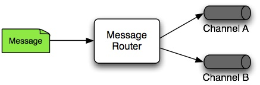
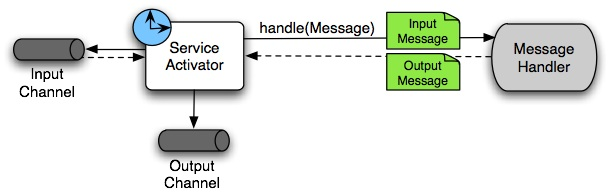

[[spring-integration-introduction]]
= Overview of Spring Integration Framework

[[spring-integration-intro]]
Spring Integration provides an extension of the Spring programming model to support the well known https://www.enterpriseintegrationpatterns.com/[Enterprise Integration Patterns].
It enables lightweight messaging within Spring-based applications and supports integration with external systems through declarative adapters.
Those adapters provide a higher level of abstraction over Spring's support for remoting, messaging, and scheduling.

Spring Integration's primary goal is to provide a simple model for building enterprise integration solutions while maintaining the separation of concerns that is essential for producing maintainable, testable code.

[[overview]]
== Spring Integration Overview

This chapter provides a high-level introduction to Spring Integration's core concepts and components.
It includes some programming tips to help you make the most of Spring Integration.

[[overview-background]]
=== Background

One of the key themes of the Spring Framework is Inversion of Control (IoC).
In its broadest sense, this means that the framework handles responsibilities on behalf of the components that are managed within its context.
The components themselves are simplified, because they are relieved of those responsibilities.
For example, dependency injection relieves the components of the responsibility of locating or creating their dependencies.
Likewise, aspect-oriented programming relieves business components of generic cross-cutting concerns by modularizing them into reusable aspects.
In each case, the end result is a system that is easier to test, understand, maintain, and extend.

Furthermore, the Spring framework and portfolio provide a comprehensive programming model for building enterprise applications.
Developers benefit from the consistency of this model and especially from the fact that it is based upon well established best practices, such as programming to interfaces and favoring composition over inheritance.
Spring's simplified abstractions and powerful support libraries boost developer productivity while simultaneously increasing the level of testability and portability.

Spring Integration is motivated by these same goals and principles.
It extends the Spring programming model into the messaging domain and builds upon Spring's existing enterprise integration support to provide an even higher level of abstraction.
It supports message-driven architectures where inversion of control applies to runtime concerns, such as when certain business logic should run and where the response should be sent.
It supports routing and transformation of messages so that different transports and different data formats can be integrated without impacting testability.
In other words, the messaging and integration concerns are handled by the framework.
Business components are further isolated from the infrastructure, and developers are relieved of complex integration responsibilities.

As an extension of the Spring programming model, Spring Integration provides a wide variety of configuration options, including annotations, XML with namespace support, XML with generic "`bean`" elements, and direct usage of the underlying API.
That API is based upon well defined strategy interfaces and non-invasive, delegating adapters.
Spring Integration's design is inspired by the recognition of a strong affinity between common patterns within Spring and the well known patterns described in https://www.enterpriseintegrationpatterns.com/[_Enterprise Integration Patterns_], by Gregor Hohpe and Bobby Woolf (Addison Wesley, 2004).
Developers who have read that book should be immediately comfortable with the Spring Integration concepts and terminology.

[[overview-goalsandprinciples]]
=== Goals and Principles

Spring Integration is motivated by the following goals:

* Provide a simple model for implementing complex enterprise integration solutions.
* Facilitate asynchronous, message-driven behavior within a Spring-based application.
* Promote intuitive, incremental adoption for existing Spring users.

Spring Integration is guided by the following principles:

* Components should be loosely coupled for modularity and testability.
* The framework should enforce separation of concerns between business logic and integration logic.
* Extension points should be abstract in nature (but within well-defined boundaries) to promote reuse and portability.

[[overview-components]]
=== Main Components

From a vertical perspective, a layered architecture facilitates separation of concerns, and interface-based contracts between layers promote loose coupling.
Spring-based applications are typically designed this way, and the Spring framework and portfolio provide a strong foundation for following this best practice for the full stack of an enterprise application.
Message-driven architectures add a horizontal perspective, yet these same goals are still relevant.
Just as "`layered architecture`" is an extremely generic and abstract paradigm, messaging systems typically follow the similarly abstract "`pipes-and-filters`" model.
The "`filters`" represent any components capable of producing or consuming messages, and the "`pipes`" transport the messages between filters so that the components themselves remain loosely-coupled.
It is important to note that these two high-level paradigms are not mutually exclusive.
The underlying messaging infrastructure that supports the "`pipes`" should still be encapsulated in a layer whose contracts are defined as interfaces.
Likewise, the "`filters`" themselves should be managed within a layer that is logically above the application's service layer, interacting with those services through interfaces in much the same way that a web tier would.

[[overview-components-message]]
==== Message

In Spring Integration, a message is a generic wrapper for any Java object combined with metadata used by the framework while handling that object.
It consists of a payload and headers.
The payload can be of any type, and the headers hold commonly required information such as ID, timestamp, correlation ID, and return address.
Headers are also used for passing values to and from connected transports.
For example, when creating a message from a received file, the file name may be stored in a header to be accessed by downstream components.
Likewise, if a message's content is ultimately going to be sent by an outbound mail adapter, the various properties (to, from, cc, subject, and others) may be configured as message header values by an upstream component.
Developers can also store any arbitrary key-value pairs in the headers.

.Message
image::images/message.jpg["Message", align="center"]

[[overview-components-channel]]
==== Message Channel

A message channel represents the "`pipe`" of a pipes-and-filters architecture.
Producers send messages to a channel, and consumers receive messages from a channel.
The message channel therefore decouples the messaging components and also provides a convenient point for interception and monitoring of messages.

.Message Channel

image::images/channel.jpg["Message Channel", align="center"]

A message channel may follow either point-to-point or publish-subscribe semantics.
With a point-to-point channel, no more than one consumer can receive each message sent to the channel.
Publish-subscribe channels, on the other hand, attempt to broadcast each message to all subscribers on the channel.
Spring Integration supports both of these models.

Whereas "`point-to-point`" and "publish-subscribe" define the two options for how many consumers ultimately receive each message, there is another important consideration: Should the channel buffer messages?
In Spring Integration, pollable channels are capable of buffering Messages within a queue.
The advantage of buffering is that it allows for throttling the inbound messages and thereby prevents overloading a consumer.
However, as the name suggests, this also adds some complexity, since a consumer can only receive the messages from such a channel if a poller is configured.
On the other hand, a consumer connected to a subscribable channel is simply message-driven.
<<./channel.adoc#channel-implementations,Message Channel Implementations>> has a detailed discussion of the variety of channel implementations available in Spring Integration.

[[overview-components-endpoint]]
==== Message Endpoint

One of the primary goals of Spring Integration is to simplify the development of enterprise integration solutions through inversion of control.
This means that you should not have to implement consumers and producers directly, and you should not even have to build messages and invoke send or receive operations on a message channel.
Instead, you should be able to focus on your specific domain model with an implementation based on plain objects.
Then, by providing declarative configuration, you can "`connect`" your domain-specific code to the messaging infrastructure provided by Spring Integration.
The components responsible for these connections are message endpoints.
This does not mean that you should necessarily connect your existing application code directly.
Any real-world enterprise integration solution requires some amount of code focused upon integration concerns such as routing and transformation.
The important thing is to achieve separation of concerns between the integration logic and the business logic.
In other words, as with the Model-View-Controller (MVC) paradigm for web applications, the goal should be to provide a thin but dedicated layer that translates inbound requests into service layer invocations and then translates service layer return values into outbound replies.
The next section provides an overview of the message endpoint types that handle these responsibilities, and, in upcoming chapters, you can see how Spring Integration's declarative configuration options provide a non-invasive way to use each of these.

[[overview-endpoints]]
=== Message Endpoints

A Message Endpoint represents the "`filter`" of a pipes-and-filters architecture.
As mentioned earlier, the endpoint's primary role is to connect application code to the messaging framework and to do so in a non-invasive manner.
In other words, the application code should ideally have no awareness of the message objects or the message channels.
This is similar to the role of a controller in the MVC paradigm.
Just as a controller handles HTTP requests, the message endpoint handles messages.
Just as controllers are mapped to URL patterns, message endpoints are mapped to message channels.
The goal is the same in both cases: isolate application code from the infrastructure.
These concepts and all of the patterns that follow are discussed at length in the https://www.enterpriseintegrationpatterns.com/[_Enterprise Integration Patterns_] book.
Here, we provide only a high-level description of the main endpoint types supported by Spring Integration and the roles associated with those types.
The chapters that follow elaborate and provide sample code as well as configuration examples.

[[overview-endpoints-transformer]]
==== Message Transformer

A message transformer is responsible for converting a message's content or structure and returning the modified message.
Probably the most common type of transformer is one that converts the payload of the message from one format to another (such as from XML to `java.lang.String`).
Similarly, a transformer can add, remove, or modify the message's header values.

[[overview-endpoints-filter]]
==== Message Filter

A message filter determines whether a message should be passed to an output channel at all.
This simply requires a boolean test method that may check for a particular payload content type, a property value, the presence of a header, or other conditions.
If the message is accepted, it is sent to the output channel.
If not, it is dropped (or, for a more severe implementation, an `Exception` could be thrown).
Message filters are often used in conjunction with a publish-subscribe channel, where multiple consumers may receive the same message and use the criteria of the filter to narrow down the set of messages to be processed.

NOTE: Be careful not to confuse the generic use of "`filter`" within the pipes-and-filters architectural pattern with this specific endpoint type that selectively narrows down the messages flowing between two channels.
The pipes-and-filters concept of a "`filter`" matches more closely with Spring Integration's message endpoint: any component that can be connected to a message channel in order to send or receive messages.

[[overview-endpoints-router]]
==== Message Router

A message router is responsible for deciding what channel or channels (if any) should receive the message next.
Typically, the decision is based upon the message's content or the metadata available in the message headers.
A message router is often used as a dynamic alternative to a statically configured output channel on a service activator or other endpoint capable of sending reply messages.
Likewise, a message router provides a proactive alternative to the reactive message filters used by multiple subscribers, as described earlier.

.Message Router

[[overview-endpoints-splitter]]
==== Splitter

A splitter is another type of message endpoint whose responsibility is to accept a message from its input channel, split that message into multiple messages, and send each of those to its output channel.
This is typically used for dividing a "`composite`" payload object into a group of messages containing the subdivided payloads.

[[overview-endpoints-aggregator]]
==== Aggregator

Basically a mirror-image of the splitter, the aggregator is a type of message endpoint that receives multiple messages and combines them into a single message.
In fact, aggregators are often downstream consumers in a pipeline that includes a splitter.
Technically, the aggregator is more complex than a splitter, because it is required to maintain state (the messages to be aggregated), to decide when the complete group of messages is available, and to timeout if necessary.
Furthermore, in case of a timeout, the aggregator needs to know whether to send the partial results, discard them, or send them to a separate channel.
Spring Integration provides a `CorrelationStrategy`, a `ReleaseStrategy`, and configurable settings for timeout, whether
to send partial results upon timeout, and a discard channel.

[[overview-endpoints-service-activator]]
==== Service Activator

A Service Activator is a generic endpoint for connecting a service instance to the messaging system.
The input message channel must be configured, and, if the service method to be invoked is capable of returning a value, an output message Channel may also be provided.

NOTE: The output channel is optional, since each message may also provide its own 'Return Address' header.
This same rule applies for all consumer endpoints.

The service activator invokes an operation on some service object to process the request message, extracting the request message's payload and converting (if the method does not expect a message-typed parameter).
Whenever the service object's method returns a value, that return value is likewise converted to a reply message if necessary (if it is not already a message type).
That reply message is sent to the output channel.
If no output channel has been configured, the reply is sent to the channel specified in the message's "`return address`", if available.

A request-reply service activator endpoint connects a target object's method to input and output Message Channels.

.Service Activator

NOTE: As discussed earlier, in <<overview-components-channel, Message Channel>>, channels can be pollable or subscribable.
In the preceding diagram, this is depicted by the "`clock`" symbol and the solid arrow (poll) and the dotted arrow (subscribe).

[[overview-endpoints-channeladapter]]
==== Channel Adapter

A channel adapter is an endpoint that connects a message channel to some other system or transport.
Channel adapters may be either inbound or outbound.
Typically, the channel adapter does some mapping between the message and whatever object or resource is received from or sent to the other system (file, HTTP Request, JMS message, and others).
Depending on the transport, the channel adapter may also populate or extract message header values.
Spring Integration provides a number of channel adapters, which are described in upcoming chapters.

.An inbound channel adapter endpoint connects a source system to a `MessageChannel`.
image::images/source-endpoint.jpg[align="center", scaledwidth=100%]

NOTE: Message sources can be pollable (for example, POP3) or message-driven (for example, IMAP Idle).
In the preceding diagram, this is depicted by the "`clock`" symbol and the solid arrow (poll) and the dotted arrow (message-driven).

.An outbound channel adapter endpoint connects a `MessageChannel` to a target system.
image::images/target-endpoint.jpg[align="center", scaledwidth=100%]

NOTE: As discussed earlier in <<overview-components-channel, Message Channel>>, channels can be pollable or subscribable.
In the preceding diagram, this is depicted by the "`clock`" symbol and the solid arrow (poll) and the dotted arrow (subscribe).

[[endpoint-bean-names]]
==== Endpoint Bean Names

Consuming endpoints (anything with an `inputChannel`) consist of two beans, the consumer and the message handler.
The consumer has a reference to the message handler and invokes it as messages arrive.

Consider the following XML example:

====
[source, xml]
----
<int:service-activator id = "someService" ... />
----
====

Given the preceding example, the bean names are as follows:

* Consumer: `someService` (the `id`)
* Handler: `someService.handler`

When using Enterprise Integration Pattern (EIP) annotations, the names depend on several factors.
Consider the following example of an annotated POJO:

====
[source, java]
----
@Component
public class SomeComponent {

    @ServiceActivator(inputChannel = ...)
    public String someMethod(...) {
        ...
    }

}
----
====

Given the preceding example, the bean names are as follows:

* Consumer: `someComponent.someMethod.serviceActivator`
* Handler: `someComponent.someMethod.serviceActivator.handler`

Starting with version 5.0.4, you can modify these names by using the `@EndpointId` annotation, as the following example shows:

====
[source, java]
----
@Component
public class SomeComponent {

    @EndpointId("someService")
    @ServiceActivator(inputChannel = ...)
    public String someMethod(...) {
        ...
    }

}
----
====

Given the preceding example, the bean names are as follows:

* Consumer: `someService`
* Handler: `someService.handler`

The `@EndpointId` creates names as created by the `id` attribute with XML configuration.
Consider the following example of an annotated bean:

====
[source, java]
----
@Configuration
public class SomeConfiguration {

    @Bean
    @ServiceActivator(inputChannel = ...)
    public MessageHandler someHandler() {
        ...
    }

}
----
====

Given the preceding example, the bean names are as follows:

* Consumer: `someConfiguration.someHandler.serviceActivator`
* Handler: `someHandler` (the `@Bean` name)

Starting with version 5.0.4, you can modify these names by using the `@EndpointId` annotation, as the following example shows:

====
[source, java]
----
@Configuration
public class SomeConfiguration {

    @Bean("someService.handler")             <1>
    @EndpointId("someService")               <2>
    @ServiceActivator(inputChannel = ...)
    public MessageHandler someHandler() {
        ...
    }

}
----

<1> Handler: `someService.handler` (the bean name)
<2> Consumer: `someService` (the endpoint ID)
====

The `@EndpointId` annotation creates names as created by the `id` attribute with XML configuration, as long as you use the convention of appending `.handler` to the `@Bean` name.

There is one special case where a third bean is created: For architectural reasons, if a `MessageHandler` `@Bean` does not define an `AbstractReplyProducingMessageHandler`, the framework wraps the provided bean in a `ReplyProducingMessageHandlerWrapper`.
This wrapper supports request handler advice handling and emits the normal 'produced no reply' debug log messages.
Its bean name is the handler bean name plus `.wrapper` (when there is an `@EndpointId` -- otherwise, it is the normal generated handler name).

Similarly <<./polling-consumer.adoc#pollable-message-source, Pollable Message Sources>> create two beans, a `SourcePollingChannelAdapter` (SPCA) and a `MessageSource`.

Consider the following XML configuration:

====
[source, xml]
----
<int:inbound-channel-adapter id = "someAdapter" ... />
----
====

Given the preceding XML configuration, the bean names are as follows:

* SPCA: `someAdapter` (the `id`)
* Handler: `someAdapter.source`

Consider the following Java configuration of a POJO to define an `@EndpointId`:

====
[source, java]
----
@EndpointId("someAdapter")
@InboundChannelAdapter(channel = "channel3", poller = @Poller(fixedDelay = "5000"))
public String pojoSource() {
    ...
}
----
====

Given the preceding Java configuration example, the bean names are as follows:

* SPCA: `someAdapter`
* Handler: `someAdapter.source`

Consider the following Java configuration of a bean to define an `@EndpointID`:

====
[source, java]
----
@Bean("someAdapter.source")
@EndpointId("someAdapter")
@InboundChannelAdapter(channel = "channel3", poller = @Poller(fixedDelay = "5000"))
public MessageSource<?> source() {
    return () -> {
        ...
    };
}
----
====

Given the preceding example, the bean names are as follows:

* SPCA: `someAdapter`
* Handler: `someAdapter.source` (as long as you use the convention of appending `.source` to the `@Bean` name)

[[configuration-enable-integration]]
=== Configuration and `@EnableIntegration`

Throughout this document, you can see references to XML namespace support for declaring elements in a Spring Integration flow.
This support is provided by a series of namespace parsers that generate appropriate bean definitions to implement a particular component.
For example, many endpoints consist of a `MessageHandler` bean and a `ConsumerEndpointFactoryBean` into which the handler and an input channel name are injected.

The first time a Spring Integration namespace element is encountered, the framework automatically declares a number of beans (a task scheduler, an implicit channel creator, and others) that are used to support the runtime environment.

IMPORTANT: Version 4.0 introduced the `@EnableIntegration` annotation, to allow the registration of Spring Integration infrastructure beans (see the https://docs.spring.io/spring-integration/docs/latest-ga/api/org/springframework/integration/config/EnableIntegration.html[Javadoc]).
This annotation is required when only Java configuration is used -- for example with Spring Boot or Spring Integration Messaging Annotation support and Spring Integration Java DSL with no XML integration configuration.

The `@EnableIntegration` annotation is also useful when you have a parent context with no Spring Integration components and two or more child contexts that use Spring Integration.
It lets these common components be declared once only, in the parent context.

The `@EnableIntegration` annotation registers many infrastructure components with the application context.
In particular, it:

* Registers some built-in beans, such as `errorChannel` and its `LoggingHandler`, `taskScheduler` for pollers, `jsonPath` SpEL-function, and others.
* Adds several `BeanFactoryPostProcessor` instances to enhance the `BeanFactory` for global and default integration environment.
* Adds several `BeanPostProcessor` instances to enhance or convert and wrap particular beans for integration purposes.
* Adds annotation processors to parse messaging annotations and registers components for them with the application context.

The `@IntegrationComponentScan` annotation also permits classpath scanning.
This annotation plays a similar role as the standard Spring Framework `@ComponentScan` annotation, but it is restricted to components and annotations that are specific to Spring Integration, which the standard Spring Framework component scan mechanism cannot reach.
For an example, see <<./gateway.adoc#messaging-gateway-annotation,`@MessagingGateway` Annotation>>.

The `@EnablePublisher` annotation registers a `PublisherAnnotationBeanPostProcessor` bean and configures the `default-publisher-channel` for those `@Publisher` annotations that are provided without a `channel` attribute.
If more than one `@EnablePublisher` annotation is found, they must all have the same value for the default channel.
See <<./message-publishing.adoc#publisher-annotation,Annotation-driven Configuration with the `@Publisher` Annotation>> for more information.

The `@GlobalChannelInterceptor` annotation has been introduced to mark `ChannelInterceptor` beans for global channel interception.
This annotation is an analogue of the `<int:channel-interceptor>` XML element (see <<./channel.adoc#global-channel-configuration-interceptors,Global Channel Interceptor Configuration>>).
`@GlobalChannelInterceptor` annotations can be placed at the class level (with a `@Component` stereotype annotation) or on `@Bean` methods within `@Configuration` classes.
In either case, the bean must implement `ChannelInterceptor`.

Starting with version 5.1, global channel interceptors apply to dynamically registered channels -- such as beans that are initialized by using `beanFactory.initializeBean()` or through the `IntegrationFlowContext` when using the Java DSL.
Previously, interceptors were not applied when beans were created after the application context was refreshed.

The `@IntegrationConverter` annotation marks `Converter`, `GenericConverter`, or `ConverterFactory` beans as candidate converters for `integrationConversionService`.
This annotation is an analogue of the `<int:converter>` XML element (see <<./endpoint.adoc#payload-type-conversion,Payload Type Conversion>>).
You can place `@IntegrationConverter` annotations at the class level (with a `@Component` stereotype annotation) or on `@Bean` methods within `@Configuration` classes.

See <<./configuration.adoc#annotations,Annotation Support>> for more information about messaging annotations.

[[programming-considerations]]
=== Programming Considerations

You should use plain old java objects (POJOs) whenever possible and only expose the framework in your code when absolutely necessary.
See <<pojo-invocation>> for more information.

If you do expose the framework to your classes, there are some considerations that need to be taken into account, especially during application startup:

* If your component is `ApplicationContextAware`, you should generally not use the `ApplicationContext` in the `setApplicationContext()` method.
Instead, store a reference and defer such uses until later in the context lifecycle.

* If your component is an `InitializingBean` or uses `@PostConstruct` methods, do not send any messages from these initialization methods.
The application context is not yet initialized when these methods are called, and sending such messages is likely to fail.
If you need to send a messages during startup, implement `ApplicationListener` and wait for the `ContextRefreshedEvent`.
Alternatively, implement `SmartLifecycle`, put your bean in a late phase, and send the messages from the `start()` method.

[[shaded]]
==== Considerations When Using Packaged (for example, Shaded) Jars

Spring Integration bootstraps certain features by using Spring Framework's `SpringFactories` mechanism to load several `IntegrationConfigurationInitializer` classes.
This includes the `-core` jar as well as certain others, including `-http` and `-jmx`.
The information for this process is stored in a `META-INF/spring.factories` file in each jar.

Some developers prefer to repackage their application and all dependencies into a single jar by using well known tools, such as the https://maven.apache.org/plugins/maven-shade-plugin/[Apache Maven Shade Plugin].

By default, the shade plugin does not merge the `spring.factories` files when producing the shaded jar.

In addition to `spring.factories`, other `META-INF` files (`spring.handlers` and `spring.schemas`) are used for XML configuration.
These files also need to be merged.

IMPORTANT: https://docs.spring.io/spring-boot/docs/current/reference/html/executable-jar.html[Spring Boot's executable jar mechanism] takes a different approach, in that it nests the jars, thus retaining each `spring.factories` file on the class path.
So, with a Spring Boot application, nothing more is needed if you use its default executable jar format.

Even if you do not use Spring Boot, you can still use the tooling provided by Boot to enhance the shade plugin by adding transformers for the above mentioned files.
The following example shows how to configure the plugin:

.pom.xml
====
[source, xml]
----
...
    <plugins>
        <plugin>
            <groupId>org.apache.maven.plugins</groupId>
            <artifactId>maven-shade-plugin</artifactId>
            <configuration>
                <keepDependenciesWithProvidedScope>true</keepDependenciesWithProvidedScope>
                <createDependencyReducedPom>true</createDependencyReducedPom>
            </configuration>
            <dependencies>
                <dependency> <1>
                    <groupId>org.springframework.boot</groupId>
                    <artifactId>spring-boot-maven-plugin</artifactId>
                    <version>${spring.boot.version}</version>
                </dependency>
            </dependencies>
            <executions>
                <execution>
                    <phase>package</phase>
                    <goals>
                        <goal>shade</goal>
                    </goals>
                    <configuration>
                        <transformers> <2>
                            <transformer
                                implementation="org.apache.maven.plugins.shade.resource.AppendingTransformer">
                                <resource>META-INF/spring.handlers</resource>
                            </transformer>
                            <transformer
                                implementation="org.springframework.boot.maven.PropertiesMergingResourceTransformer">
                                <resource>META-INF/spring.factories</resource>
                            </transformer>
                            <transformer
                                implementation="org.apache.maven.plugins.shade.resource.AppendingTransformer">
                                <resource>META-INF/spring.schemas</resource>
                            </transformer>
                            <transformer
                                implementation="org.apache.maven.plugins.shade.resource.ServicesResourceTransformer" />
                        </transformers>
                    </configuration>
                </execution>
            </executions>
        </plugin>
    </plugins>
...
----

Specifically,

<1> Add the `spring-boot-maven-plugin` as a dependency.

<2> Configure the transformers.
====

You can add a property for `${spring.boot.version}` or use an explicit version.

[[programming-tips]]
=== Programming Tips and Tricks

This section documents some of the ways to get the most from Spring Integration.

==== XML Schemas

When using XML configuration, to avoid getting false schema validation errors, you should use a "`Spring-aware`" IDE, such as the Spring Tool Suite (STS), Eclipse with the Spring IDE plugins, or IntelliJ IDEA.
These IDEs know how to resolve the correct XML schema from the classpath (by using the `META-INF/spring.schemas` file in the jars).
When using STS or Eclipse with the plugin, you must enable `Spring Project Nature` on the project.

The schemas hosted on the internet for certain legacy modules (those that existed in version 1.0) are the 1.0 versions for compatibility reasons.
If your IDE uses these schemas, you are likely to see false errors.

Each of these online schemas has a warning similar to the following:

[IMPORTANT]
====
This schema is for the 1.0 version of Spring Integration Core.
We cannot update it to the current schema because that will break any applications using 1.0.3 or lower.
For subsequent versions, the unversioned schema is resolved from the classpath and obtained from the jar.
Please refer to github:

https://github.com/spring-projects/spring-integration/tree/main/spring-integration-core/src/main/resources/org/springframework/integration/config
====

The affected modules are

* `core`  (`spring-integration.xsd`)
* `file`
* `http`
* `jms`
* `mail`
* `rmi`
* `security`
* `stream`
* `ws`
* `xml`

==== Finding Class Names for Java and DSL Configuration

With XML configuration and Spring Integration Namespace support, the XML parsers hide how target beans are declared and wired together.
For Java configuration, it is important to understand the Framework API for target end-user applications.

The first-class citizens for EIP implementation are `Message`, `Channel`, and `Endpoint` (see <<overview-components>>, earlier in this chapter).
Their implementations (contracts) are:

* `org.springframework.messaging.Message`: See <<./message.adoc#message,Message>>;
* `org.springframework.messaging.MessageChannel`: See <<./channel.adoc#channel,Message Channels>>;
* `org.springframework.integration.endpoint.AbstractEndpoint`: See <<./polling-consumer.adoc#polling-consumer,Poller>>.

The first two are simple enough to understand how to implement, configure, and use.
The last one deserves more attention

The `AbstractEndpoint` is widely used throughout the Spring Framework for different component implementations.
Its main implementations are:

* `EventDrivenConsumer`, used when we subscribe to a `SubscribableChannel` to listen for messages.
* `PollingConsumer`, used when we poll for messages from a `PollableChannel`.

When you use messaging annotations or the Java DSL, you need to worry about these components, because the Framework automatically produces them with appropriate annotations and `BeanPostProcessor` implementations.
When building components manually, you should use the `ConsumerEndpointFactoryBean` to help determine the target `AbstractEndpoint` consumer implementation to create, based on the provided `inputChannel` property.

On the other hand, the `ConsumerEndpointFactoryBean` delegates to an another first class citizen in the Framework - `org.springframework.messaging.MessageHandler`.
The goal of the implementation of this interface is to handle the message consumed by the endpoint from the channel.
All EIP components in Spring Integration are `MessageHandler` implementations (for example, `AggregatingMessageHandler`, `MessageTransformingHandler`, `AbstractMessageSplitter`, and others).
The target protocol outbound adapters (`FileWritingMessageHandler`, `HttpRequestExecutingMessageHandler`, `AbstractMqttMessageHandler`, and others) are also `MessageHandler` implementations.
When you develop Spring Integration applications with Java configuration, you should look into the Spring Integration module to find an appropriate `MessageHandler` implementation to use for the `@ServiceActivator` configuration.
For example, to send an XMPP message (see <<./xmpp.adoc#xmpp,XMPP Support>>) you should configure something like the following:

====
[source,java]
----
@Bean
@ServiceActivator(inputChannel = "input")
public MessageHandler sendChatMessageHandler(XMPPConnection xmppConnection) {
    ChatMessageSendingMessageHandler handler = new ChatMessageSendingMessageHandler(xmppConnection);

    DefaultXmppHeaderMapper xmppHeaderMapper = new DefaultXmppHeaderMapper();
    xmppHeaderMapper.setRequestHeaderNames("*");
    handler.setHeaderMapper(xmppHeaderMapper);

    return handler;
}
----
====

The `MessageHandler` implementations represent the outbound and processing part of the message flow.

The inbound message flow side has its own components, which are divided into polling and listening behaviors.
The listening (message-driven) components are simple and typically require only one target class implementation to be ready to
produce messages.
Listening components can be one-way `MessageProducerSupport` implementations, (such as `AbstractMqttMessageDrivenChannelAdapter` and `ImapIdleChannelAdapter`) or request-reply  `MessagingGatewaySupport` implementations (such as `AmqpInboundGateway` and `AbstractWebServiceInboundGateway`).

Polling inbound endpoints are for those protocols that do not provide a listener API or are not intended for
such a behavior, including any file based protocol (such as FTP), any data bases (RDBMS or NoSQL), and others.

These inbound endpoints consist of two components: the poller configuration, to initiate the polling task periodically,
and a message source class to read data from the target protocol and produce a message for the downstream integration flow.
The first class for the poller configuration is a `SourcePollingChannelAdapter`.
It is one more `AbstractEndpoint` implementation, but especially for polling to initiate an integration flow.
Typically, with the messaging annotations or Java DSL, you should not worry about this class.
The Framework produces a bean for it, based on the `@InboundChannelAdapter` configuration or a Java DSL builder spec.

Message source components are more important for the target application development, and they all implement the `MessageSource` interface (for example, `MongoDbMessageSource` and `AbstractTwitterMessageSource`).
With that in mind, our config for reading data from an RDBMS table with JDBC could resemble the following:

====
[source,java]
----
@Bean
@InboundChannelAdapter(value = "fooChannel", poller = @Poller(fixedDelay="5000"))
public MessageSource<?> storedProc(DataSource dataSource) {
    return new JdbcPollingChannelAdapter(dataSource, "SELECT * FROM foo where status = 0");
}
----
====

You can find all the required inbound and outbound classes for the target protocols in the particular Spring Integration module (in most cases, in the respective package).
For example, the `spring-integration-websocket` adapters are:

* `o.s.i.websocket.inbound.WebSocketInboundChannelAdapter`: Implements `MessageProducerSupport` to listen for frames on the socket and produce message to the channel.
* `o.s.i.websocket.outbound.WebSocketOutboundMessageHandler`: The one-way `AbstractMessageHandler` implementation to convert incoming messages to the appropriate frame and send over websocket.

If you are familiar with Spring Integration XML configuration, starting with version 4.3, we provide information in the
XSD element definitions about which target classes are used to declare beans for the adapter or gateway, as the following example shows:

====
[source,xml]
----
<xsd:element name="outbound-async-gateway">
    <xsd:annotation>
		<xsd:documentation>
Configures a Consumer Endpoint for the 'o.s.i.amqp.outbound.AsyncAmqpOutboundGateway'
that will publish an AMQP Message to the provided Exchange and expect a reply Message.
The sending thread returns immediately; the reply is sent asynchronously; uses 'AsyncRabbitTemplate.sendAndReceive()'.
       </xsd:documentation>
	</xsd:annotation>
----
====

[[pojo-invocation]]
=== POJO Method invocation

As discussed in <<programming-considerations>>, we recommend using a POJO programming style, as the following example shows:

====
[source, java]
----
@ServiceActivator
public String myService(String payload) { ... }
----
====

In this case, the framework extracts a `String` payload, invokes your method, and wraps the result in a message to send to the next component in the flow (the original headers are copied to the new message).
In fact, if you use XML configuration, you do not even need the `@ServiceActivator` annotation, as the following paired examples show:

====
[source, xml]
----
<int:service-activator ... ref="myPojo" method="myService" />
----

[source, java]
----
public String myService(String payload) { ... }
----
====

You can omit the `method` attribute as long as there is no ambiguity in the public methods on the class.

You can also obtain header information in your POJO methods, as the following example shows:

====
[source, java]
----
@ServiceActivator
public String myService(@Payload String payload, @Header("foo") String fooHeader) { ... }
----
====

You can also dereference properties on the message, as the following example shows:

====
[source, java]
----
@ServiceActivator
public String myService(@Payload("payload.foo") String foo, @Header("bar.baz") String barbaz) { ... }
----
====

Because various POJO method invocations are available, versions prior to 5.0 used SpEL (Spring Expression Language) to invoke the POJO methods.
SpEL (even interpreted) is usually "`fast enough`" for these operations, when compared to the actual work usually done in the methods.
However, starting with version 5.0, the `org.springframework.messaging.handler.invocation.InvocableHandlerMethod` is used by default whenever possible.
This technique is usually faster to execute than interpreted SpEL and is consistent with other Spring messaging projects.
The `InvocableHandlerMethod` is similar to the technique used to invoke controller methods in Spring MVC.
There are certain methods that are still always invoked when using SpEL.
Examples include annotated parameters with dereferenced properties, as discussed earlier.
This is because SpEL has the capability to navigate a property path.

There may be some other corner cases that we have not considered that also do not work with `InvocableHandlerMethod` instances.
For this reason, we automatically fall back to using SpEL in those cases.

If you wish, you can also set up your POJO method such that it always uses SpEL, with the `UseSpelInvoker` annotation, as the following example shows:

====
[source, java]
----
@UseSpelInvoker(compilerMode = "IMMEDIATE")
public void bar(String bar) { ... }
----
====

If the `compilerMode` property is omitted, the `spring.expression.compiler.mode` system property determines the compiler mode.
See https://docs.spring.io/spring-framework/docs/current/spring-framework-reference/core.html#expressions-spel-compilation[SpEL compilation] for more information about compiled SpEL.
