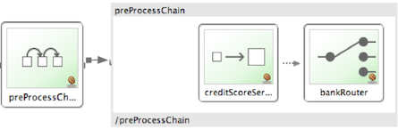
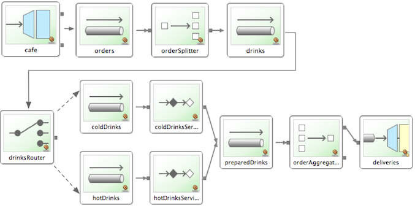

[[samples]]
== Spring Integration Samples

As of Spring Integration 2.0, the Spring Integration distribution no longer includes the samples.
Instead, we have switched to a much simpler collaborative model that should promote better community participation and, ideally, more contributions.
Samples now have a dedicated GitHub repository.
Sample development also has its own lifecycle, which is not dependent on the lifecycle of the framework releases, although the repository is still tagged with each major release for compatibility reasons.

The great benefit to the community is that we can now add more samples and make them available to you right away without waiting for the next release.
Having its own GitHub repository that is not tied to the the actual framework is also a great benefit.
You now have a dedicated place to suggest samples as well as report issues with existing samples.
You can also submit a sample to us as a Pull Request.
If we believe your sample adds value, we would be more then glad to add it to the 'samples' repository, properly crediting you as the author.

[[samples-get]]
=== Where to Get Samples

The Spring Integration Samples project is hosted on https://github.com/spring-projects/spring-integration-samples/[GitHub].
In order to check out or clone the samples, you must have a Git client installed on your system.
There are several GUI-based products available for many platforms (such as https://eclipse.org/egit/[EGit] for the Eclipse IDE).
A simple Google search can help you find them.
You can also use the command line interface for https://git-scm.com/[Git].

NOTE: If you need more information on how to install or use Git, visit: https://git-scm.com/[https://git-scm.com/].

To clone (check out) the Spring Integration samples repository by using the Git command line tool, issue the following command:

====
[source,xml]
----
$ git clone https://github.com/spring-projects/spring-integration-samples.git
----
====

The preceding command clones the entire samples repository into a directory named `spring-integration-samples` within the working directory where you issued that `git` command.
Since the samples repository is a live repository, you might want to perform periodic pulls (updates) to get new samples and updates to the existing samples.
To do so, issue the following `git pull` command:

====
[source,xml]
----
$ git pull
----
====

=== Submitting Samples or Sample Requests

You can submit both new samples and requests for samples.
We greatly appreciate any effort toward improving the samples, including the sharing of good ideas.

[[samples-how-can-i-contribute]]
==== How Can I Contribute My Own Samples?

Github is for social coding: if you want to submit your own code examples to the Spring Integration Samples project, we encourage contributions through https://help.github.com/en/articles/creating-a-pull-request/[pull requests] from https://help.github.com/en/articles/fork-a-repo[forks] of this repository.
If you want to contribute code this way, please reference, if possible, a https://github.com/spring-projects/spring-integration-samples/issues[GutHub issue] that provides some details regarding your sample.

[IMPORTANT]
.Sign the contributor license agreement
=====

Very important: Before we can accept your Spring Integration sample, we need you to sign the SpringSource contributor license agreement (CLA).
Signing the contributor's agreement does not grant anyone commit rights to the main repository, but it does mean that we can accept your contributions, and you will get an author credit if we do.
In order to read and sign the CLA, go to:

https://support.springsource.com/spring_committer_signup

From the *Project* drop down, select *Spring Integration*.
The Project Lead is Artem Bilan.
=====

==== Code Contribution Process

For the actual code contribution process, read the the Contributor Guidelines for Spring Integration.
They apply for the samples project as well.
You can find them at https://github.com/spring-projects/spring-integration/blob/main/CONTRIBUTING.md

This process ensures that every commit gets peer-reviewed.
As a matter of fact, the core committers follow the exact same rules.
We gratefully look forward to your Spring Integration samples!

==== Sample Requests

As <<samples-how-can-i-contribute,mentioned earlier>>, the Spring Integration Samples project uses GitHub issue as bug tracking system.
To submit new sample requests, visit https://github.com/spring-projects/spring-integration-samples/issues.

[[samples-structure]]
=== Samples Structure

Starting with Spring Integration 2.0, the structure of the samples has changed.
With plans for more samples, we realized that not all samples have the same goals.
They all share the common goal of showing you how to apply and work with the Spring Integration framework.
However, they differ in that some samples concentrate on a technical use case, while others focus on a business use case.
Also, some samples are about showcasing various techniques that could be applied to address certain scenarios (both technical and business).
The new categorization of samples lets us better organize them based on the problem each sample addresses while giving you a simpler way of finding the right sample for your needs.

Currently there are four categories.
Within the samples repository, each category has its own directory, which is named after the category name:

Basic (`samples/basic`)::
This is a good place to get started.
The samples here are technically motivated and demonstrate the bare minimum with regard to configuration and code.
These should help you to get started quickly by introducing you to the basic concepts, API, and configuration of Spring Integration as well as Enterprise Integration Patterns (EIP).
For example, if you are looking for an answer on how to implement and wire a service activator to a message channel, how to use a messaging gateway as a facade to your message exchange, or how to get started with MAIL, TCP/UDP or other modules, this is the right place to find a good sample.
The bottom line is `samples/basic` is a good place to get started.

Intermediate (`samples/intermediate`)::
This category targets developers who are already familiar with the Spring Integration framework (beyond getting started) but need some more guidance while resolving the more advanced technical problems they might encounter after switching to a messaging architecture.
For example, if you are looking for an answer on how to handle errors in various message exchange scenarios or how to properly configure the aggregator for a situation where some messages do not ever arrive for aggregation, or any other issue that goes beyond a basic implementation and configuration of a particular component and exposes "`what else`" types of problems, this is the right place to find these type of samples.

Advanced (`samples/advanced`)::
This category targets developers who are very familiar with the Spring Integration framework but are looking to extend it to address a specific custom need by using Spring Integration's public API.
For example, if you are looking for samples showing you how to implement a custom channel or consumer (event-based or polling-based) or you are trying to figure out the most appropriate way to implement a custom bean parser on top of the Spring Integration bean parser hierarchy (perhaps when implementing your own namespace and schema for a custom component), this is the right place to look.
Here you can also find samples that will help you with adapter development.
Spring Integration comes with an extensive library of adapters to let you connect remote systems with the Spring Integration messaging framework.
However, you might need to integrate with a system for which the core framework does not provide an adapter.
If so, you might decide to implement your own (please consider contributing it).
This category would include samples showing you how.

Applications (`samples/applications`)::
This category targets developers and architects who have a good understanding of message-driven architecture and EIP and an above-average understanding of Spring and Spring Integration who are looking for samples that address a particular business problem.
In other words, the emphasis of the samples in this category is business use cases and how they can be solved with a message-driven architecture and Spring Integration in particular.
For example, if you want to see how a loan broker or travel agent process could be implemented and automated with Spring Integration, this is the right place to find these types of samples.

IMPORTANT: Spring Integration is a community-driven framework.
Therefore community participation is IMPORTANT.
That includes samples.
If you cannot find what you are looking for, let us know!

[[samples-impl]]
=== Samples

Currently, Spring Integration comes with quite a few samples and you can only expect more.
To help you better navigate through them, each sample comes with its own `readme.txt` file which covers several details about the sample (for example, what EIP patterns it addresses, what problem it is trying to solve, how to run the sample, and other details).
However, certain samples require a more detailed and sometimes graphical explanation.
In this section, you can find details on samples that we believe require special attention.

[[samples-loan-broker]]
==== Loan Broker

This section covers the loan broker sample application that is included in the Spring Integration samples.
This sample is inspired by one of the samples featured in Gregor Hohpe and Bobby Woolf's book, https://www.enterpriseintegrationpatterns.com/[_Enterprise Integration Patterns_].

The following diagram shows the entire process:

.Loan Broker Sample
image::images/loan-broker-eip.png[align="center", scaledwidth=100%]

At the core of an EIP architecture are the very simple yet powerful concepts of pipes, filters, and, of course: messages.
Endpoints (filters) are connected with one another via channels (pipes).
Producing endpoints send messages to the channel, and the consuming endpoint retrieves the messages.
This architecture is meant to define various mechanisms that describe how information is exchanged between the endpoints, without any awareness of what those endpoints are or what information they are exchanging.
Thus, it provides for a very loosely coupled and flexible collaboration model while also decoupling integration concerns from business concerns.
EIP extends this architecture by further defining:

* The types of pipes (point-to-point channel, publish-subscribe channel, channel adapter, and others)

* The core filters and patterns around how filters collaborate with pipes (Message router, splitters and aggregators, various message transformation patterns, and others)

[[samples-loan-broker-requirements]]
Chapter 9 of the EIP book nicely describes the details and variations of this use case, but here is the brief summary: While shopping for the best loan quote, a consumer subscribes to the services of a loan broker, which handles such details as:

* Consumer pre-screening (for example, obtaining and reviewing the consumer's Credit history)

* Determining the most appropriate banks (for example, based on the consumer's credit history or score)

* Sending a loan quote request to each selected bank

* Collecting responses from each bank

* Filtering responses and determining the best quotes, based on consumer's requirements.

* Pass the Loan quotes back to the consumer.

The real process of obtaining a loan quote is generally a bit more complex.
However, since our goal is to demonstrate how Enterprise Integration Patterns are realized and implemented within Spring Integration, the use case has been simplified to concentrate only on the integration aspects of the process.
It is not an attempt to give you advice in consumer finances.

By engaging a loan broker, the consumer is isolated from the details of the loan broker's operations, and each loan broker's operations may defer from one another to maintain competitive advantage, so whatever we assemble and implement must be flexible so that any changes could be introduced quickly and painlessly.

NOTE: The loan broker sample does not actually talk to any 'imaginary' Banks or Credit bureaus.
Those services are stubbed out.

Our goal here is to assemble, orchestrate, and test the integration aspects of the process as a whole.
Only then can we start thinking about wiring such processes to the real services.
At that time, the assembled process and its configuration do not change regardless of the number of banks with which a particular loan broker deals or the type of communication media (or protocols) used (JMS, WS, TCP, and so on) to communicate with these banks.

===== Design

As you analyze the <<samples-loan-broker-requirements,six requirements>> listed earlier, you can see that they are all integration concerns.
For example, in the consumer pre-screening step, we need to gather additional information about the consumer and the consumer's desires and enrich the loan request with additional meta-information.
We then have to filter such information to select the most appropriate list of banks and so on.
Enrich, filter, and select are all integration concerns for which EIP defines a solution in the form of patterns.
Spring Integration provides an implementation of these patterns.

The following image shows a representation of a messaging gateway:

.Messaging Gateway
image::images/gateway.jpg[align="center"]

The messaging gateway pattern provides a simple mechanism to access messaging systems, including our loan broker.
In Spring Integration, you can define the gateway as a plain old java interface (you need not provide an implementation), configure it with the XML `<gateway>` element or with an annotation in Java, and use it as you would any other Spring bean.
Spring Integration takes care of delegating and mapping method invocations to the messaging infrastructure by generating a message (the payload is mapped to an input parameter of the method) and sending it to the designated channel.
The following example shows how to define such a gateway with XML:

====
[source,xml]
----
<int:gateway id="loanBrokerGateway"
  default-request-channel="loanBrokerPreProcessingChannel"
  service-interface="org.springframework.integration.samples.loanbroker.LoanBrokerGateway">
  <int:method name="getBestLoanQuote">
    <int:header name="RESPONSE_TYPE" value="BEST"/>
  </int:method>
</int:gateway>
----
====

Our current gateway provides two methods that could be invoked.
One that returns the best single quote and another one that returns all quotes.
Somehow, downstream, we need to know what type of reply the caller needs.
The best way to achieve this in messaging architecture is to enrich the content of the message with some metadata that describes your intentions.
Content Enricher is one of the patterns that addresses this.
Spring Integration does, as a convenience, provide a separate configuration element to enrich message headers with arbitrary data (described later)
However, since the `gateway` element is responsible for constructing the initial message, it includes ability to enrich the newly created message with arbitrary message headers.
In our example, we add a `RESPONSE_TYPE` header with a value of `BEST` whenever the `getBestQuote()` method is invoked.
For other methods, we do not add any header.
Now we can check downstream for the existence of this header.
Based on its presence and its value, we can determine what type of reply the caller wants.

Based on the use case, we also know tat some pre-screening steps need to be performed, such as getting and evaluating the consumer's credit score, because some premiere banks only accept quote requests from consumers that meet a minimum credit score requirement.
So it would be nice if the message would be enriched with such information before it is forwarded to the banks.
It would also be nice if, when several processes need to be completed to provide such meta-information, those processes could be grouped in a single unit.
In our use case, we need to determine the credit score and, based on the credit score and some rule, select a list of message channels (bank channels) to which to send quote request.

===== Composed Message Processor

The composed message processor pattern describes rules around building endpoints that maintain control over message flow, which consists of multiple message processors.
In Spring Integration, the composed message processor pattern is implemented by the `<chain>` element.

The following image shows the chain pattern:

.Chain

The preceding image shows that we have a chain with an inner header-enricher element that further enriches the content of the message with the `CREDIT_SCORE` header and the value (which is determined by the call to a credit service -- a simple POJO spring bean identified by 'creditBureau' name).
Then it delegates to the message router.

The following image shows the message router pattern:

.Message Router
image::images/bank-router.jpg[align="center"]

Spring Integration offers several implementations of the message routing pattern.
In this case, we use a router that determines a list of channels based on evaluating an expression (in Spring Expression Language) that looks at the credit score (determined in the previous step) and selects the list of channels from the `Map` bean with an `id` of `banks` whose values are `premier` or `secondary`, based on the value of credit score.
Once the list of channels is selected, the message is routed to those channels.

Now, one last thing the loan broker needs to receive the loan quotes form the banks, aggregate them by consumer (we do not want to show quotes from one consumer to another), assemble the response based on the consumer's selection criteria (single best quote or all quotes) and send the reply to the consumer.

The following image shows the message aggregator pattern:

.Message Aggregator

An aggregator pattern describes an endpoint that groups related messages into a single message.
Criteria and rules can be provided to determine an aggregation and correlation strategy.
Spring Integration provides several implementations of the aggregator pattern as well as a convenient namespace-based configuration.

The following example shows how to define an aggregator:

====
[source,xml]
----
<int:aggregator id="quotesAggregator"
      input-channel="quotesAggregationChannel"
      method="aggregateQuotes">
  <beans:bean class="org.springframework.integration.samples.loanbroker.LoanQuoteAggregator"/>
</int:aggregator>
----
====

Our Loan Broker defines a 'quotesAggregator' bean with the `<aggregator>` element, which provides a default aggregation and correlation strategy.
The default correlation strategy correlates messages based on the `correlationId` header (see https://www.enterpriseintegrationpatterns.com/patterns/messaging/CorrelationIdentifier.html[the correlation identifier pattern in the EIP book]).
Note that we never provided the value for this header.
It was automatically set earlier by the router, when it generated a separate message for each bank channel.

Once the messages are correlated, they are released to the actual aggregator implementation.
Although Spring Integration provides a default aggregator, its strategy (gather the list of payloads from all messages and construct a new message with this list as its payload) does not satisfy our requirement.
Having all the results in the message is a problem, because our consumer might require a single best quote or all quotes.
To communicate the consumer's intention, earlier in the process we set the `RESPONSE_TYPE` header.
Now we have to evaluate this header and return either all the quotes (the default aggregation strategy would work) or the best quote (the default aggregation strategy does not work because we have to determine which loan quote is the best).

In a more realistic application, selecting the best quote might be based on complex criteria that might influence the complexity of the aggregator implementation and configuration.
For now, though, we are making it simple.
If the consumer wants the best quote, we select a quote with the lowest interest rate.
To accomplish that, the `LoanQuoteAggregator` class sorts all the quotes by interest rate and returns the first one.
The `LoanQuote` class implements `Comparable` to compare quotes based on the rate attribute.
Once the response message is created, it is sent to the default reply channel of the messaging gateway (and, thus, to the consumer) that started the process.
Our consumer got the loan quote!

In conclusion, a rather complex process was assembled based on POJO (that is existing or legacy) logic and a light-weight, embeddable messaging framework (Spring Integration) with a loosely coupled programming model intended to simplify integration of heterogeneous systems without requiring a heavy-weight ESB-like engine or a proprietary development and deployment environment.
As a developer, you should not need to port your Swing or console-based application to an ESB-like server or implement proprietary interfaces just because you have an integration concern.

This sample and the other samples in this section are built on top of Enterprise Integration Patterns.
You can consider them to be "`building blocks`" for your solution.
They are not intended to be complete solutions.
Integration concerns exist in all types of application (whether server-based or not).
Our goal is to make is so that integrating applications does not require changes in design, testing, and deployment strategy.

[[samples-cafe]]
==== The Cafe Sample

This section covers the cafe sample application that is included in the Spring Integration samples.
This sample is inspired by another sample featured in Gregor Hohpe's https://www.enterpriseintegrationpatterns.com/ramblings.html[Ramblings].

The domain is that of a cafe, and  the following diagram depicts the basic flow:

.Cafe Sample

The `Order` object may contain multiple `OrderItems`.
Once the order is placed, a splitter breaks the composite order message into a single message for each drink.
Each of these is then processed by a router that determines whether the drink is hot or cold (by checking the `OrderItem` object's 'isIced' property).
The `Barista` prepares each drink, but hot and cold drink preparation are handled by two distinct methods: 'prepareHotDrink' and 'prepareColdDrink'.
The prepared drinks are then sent to the `Waiter` where they are aggregated into a `Delivery` object.

The following listing shows the XML configuration:

====
[source,xml]
----
<?xml version="1.0" encoding="UTF-8"?>
<beans:beans xmlns:int="http://www.springframework.org/schema/integration"
 xmlns:xsi="http://www.w3.org/2001/XMLSchema-instance"
 xmlns:beans="http://www.springframework.org/schema/beans"
 xmlns:int-stream="http://www.springframework.org/schema/integration/stream"
 xsi:schemaLocation="http://www.springframework.org/schema/beans
  https://www.springframework.org/schema/beans/spring-beans.xsd
  http://www.springframework.org/schema/integration
  https://www.springframework.org/schema/integration/spring-integration.xsd
  http://www.springframework.org/schema/integration/stream
  https://www.springframework.org/schema/integration/stream/spring-integration-stream.xsd">

    <int:gateway id="cafe" service-interface="o.s.i.samples.cafe.Cafe"/>

    <int:channel  id="orders"/>
    <int:splitter input-channel="orders" ref="orderSplitter"
                  method="split" output-channel="drinks"/>

    <int:channel id="drinks"/>
    <int:router  input-channel="drinks"
                 ref="drinkRouter" method="resolveOrderItemChannel"/>

    <int:channel id="coldDrinks"><int:queue capacity="10"/></int:channel>
    <int:service-activator input-channel="coldDrinks" ref="barista"
                           method="prepareColdDrink" output-channel="preparedDrinks"/>

    <int:channel id="hotDrinks"><int:queue capacity="10"/></int:channel>
    <int:service-activator input-channel="hotDrinks" ref="barista"
                           method="prepareHotDrink" output-channel="preparedDrinks"/>

    <int:channel id="preparedDrinks"/>
    <int:aggregator input-channel="preparedDrinks" ref="waiter"
                    method="prepareDelivery" output-channel="deliveries"/>

    <int-stream:stdout-channel-adapter id="deliveries"/>

    <beans:bean id="orderSplitter"
                class="org.springframework.integration.samples.cafe.xml.OrderSplitter"/>

    <beans:bean id="drinkRouter"
                class="org.springframework.integration.samples.cafe.xml.DrinkRouter"/>

    <beans:bean id="barista" class="o.s.i.samples.cafe.xml.Barista"/>
    <beans:bean id="waiter"  class="o.s.i.samples.cafe.xml.Waiter"/>

    <int:poller id="poller" default="true" fixed-rate="1000"/>

</beans:beans>
----
====

Each message endpoint connects to input channels, output channels, or both.
Each endpoint manages its own lifecycle (by default, endpoints start automatically upon initialization, to prevent that, add the `auto-startup` attribute with a value of `false`).
Most importantly, notice that the objects are simple POJOs with strongly typed method arguments.
The following example shows the Splitter:

====
[source,java]
----
public class OrderSplitter {
    public List<OrderItem> split(Order order) {
        return order.getItems();
    }
}
----
====

In the case of the router, the return value does not have to be a `MessageChannel` instance (although it can be).
In this example, a `String` value that holds the channel name is returned instead, as the following listing shows.

====
[source,java]
----
public class DrinkRouter {
    public String resolveOrderItemChannel(OrderItem orderItem) {
        return (orderItem.isIced()) ? "coldDrinks" : "hotDrinks";
    }
}
----
====

Now, turning back to the XML, you can see that there are two `<service-activator>` elements.
Each of these is delegating to the same `Barista` instance but with different methods (`prepareHotDrink` or `prepareColdDrink`), each corresponding to one of the two channels where order items have been routed.
The following listing shows the Barista class (which contains the `prepareHotDrink` and `prepareColdDrink` methods)

====
[source,java]
----
public class Barista {

    private long hotDrinkDelay = 5000;
    private long coldDrinkDelay = 1000;

    private AtomicInteger hotDrinkCounter = new AtomicInteger();
    private AtomicInteger coldDrinkCounter = new AtomicInteger();

    public void setHotDrinkDelay(long hotDrinkDelay) {
        this.hotDrinkDelay = hotDrinkDelay;
    }

    public void setColdDrinkDelay(long coldDrinkDelay) {
        this.coldDrinkDelay = coldDrinkDelay;
    }

    public Drink prepareHotDrink(OrderItem orderItem) {
        try {
            Thread.sleep(this.hotDrinkDelay);
            System.out.println(Thread.currentThread().getName()
                    + " prepared hot drink #" + hotDrinkCounter.incrementAndGet()
                    + " for order #" + orderItem.getOrder().getNumber()
                    + ": " + orderItem);
            return new Drink(orderItem.getOrder().getNumber(), orderItem.getDrinkType(),
                    orderItem.isIced(), orderItem.getShots());
        }
        catch (InterruptedException e) {
            Thread.currentThread().interrupt();
            return null;
        }
    }

    public Drink prepareColdDrink(OrderItem orderItem) {
        try {
            Thread.sleep(this.coldDrinkDelay);
            System.out.println(Thread.currentThread().getName()
                    + " prepared cold drink #" + coldDrinkCounter.incrementAndGet()
                    + " for order #" + orderItem.getOrder().getNumber() + ": "
                    + orderItem);
            return new Drink(orderItem.getOrder().getNumber(), orderItem.getDrinkType(),
                    orderItem.isIced(), orderItem.getShots());
        }
        catch (InterruptedException e) {
            Thread.currentThread().interrupt();
            return null;
        }
    }
}
----
====

As you can see from the preceding code excerpt, the `Barista` methods have different delays (the hot drinks take five times as long to prepare).
This simulates work being completed at different rates.
When the `CafeDemo` 'main' method runs, it loops 100 times and sends a single hot drink and a single cold drink each time.
It actually sends the messages by invoking the 'placeOrder' method on the `Cafe` interface.
In the earlier XML configuration, you can see that the `<gateway>` element is specified.
This triggers the creation of a proxy that implements the given service interface and connects it to a channel.
The channel name is provided on the `@Gateway` annotation of the `Cafe` interface, as the following interface definition shows:

====
[source,java]
----
public interface Cafe {

    @Gateway(requestChannel="orders")
    void placeOrder(Order order);

}
----
====

Finally, have a look at the `main()` method of the `CafeDemo` itself:

====
[source,java]
----
public static void main(String[] args) {
    AbstractApplicationContext context = null;
    if (args.length > 0) {
        context = new FileSystemXmlApplicationContext(args);
    }
    else {
        context = new ClassPathXmlApplicationContext("cafeDemo.xml", CafeDemo.class);
    }
    Cafe cafe = context.getBean("cafe", Cafe.class);
    for (int i = 1; i <= 100; i++) {
        Order order = new Order(i);
        order.addItem(DrinkType.LATTE, 2, false);
        order.addItem(DrinkType.MOCHA, 3, true);
        cafe.placeOrder(order);
    }
}
----
====

TIP: To run this sample as well as eight others, refer to the `README.txt` within the `samples` directory of the main distribution (as described at <<samples,the beginning of this chapter>>).

When you run `cafeDemo`, you can see that the cold drinks are initially prepared more quickly than the hot drinks.
Because there is an aggregator, the cold drinks are effectively limited by the rate of the hot drink preparation.
This is to be expected, based on their respective delays of 1000 and 5000 milliseconds.
However, by configuring a poller with a concurrent task executor, you can dramatically change the results.
For example, you could use a thread pool executor with five workers for the hot drink barista while keeping the cold drink barista as it is.
The following listing configures such an arrangement:

====
[source,xml]
----
<int:service-activator input-channel="hotDrinks"
                     ref="barista"
                     method="prepareHotDrink"
                     output-channel="preparedDrinks"/>

  <int:service-activator input-channel="hotDrinks"
                     ref="barista"
                     method="prepareHotDrink"
                     output-channel="preparedDrinks">
      <int:poller task-executor="pool" fixed-rate="1000"/>
  </int:service-activator>

  <task:executor id="pool" pool-size="5"/>
----
====

Also, notice that the worker thread name is displayed with each invocation.
You can see that the hot drinks are prepared by the task-executor threads.
If you provide a much shorter poller interval (such as 100 milliseconds), you can see that it occasionally throttles the input by forcing the task scheduler (the caller) to invoke the operation.

NOTE: In addition to experimenting with the poller's concurrency settings, you can also add the 'transactional' child element and then refer to any `PlatformTransactionManager` instance within the context.

[[samples-xml-messaging]]
==== The XML Messaging Sample

The XML messaging sample in `basic/xml` shows how to use some of the provided components that deal with XML payloads.
The sample uses the idea of processing an order for books represented as XML.

NOTE: This sample shows that the namespace prefix can be whatever you want.
While we usually use, `int-xml` for integration XML components, the sample uses `si-xml`.
(`int` is short for "`Integration`", and `si` is short for "`Spring Integration`".)

First, the order is split into a number of messages, each one representing a single order item from the XPath splitter component.
The following listing shows the configuration of the splitter:

====
[source,xml]
----
<si-xml:xpath-splitter id="orderItemSplitter" input-channel="ordersChannel"
              output-channel="stockCheckerChannel" create-documents="true">
      <si-xml:xpath-expression expression="/orderNs:order/orderNs:orderItem"
                                namespace-map="orderNamespaceMap" />
  </si-xml:xpath-splitter>
----
====

A service activator then passes the message into a stock checker POJO.
The order item document is enriched with information from the stock checker about the order item stock level.
This enriched order item message is then used to route the message.
In the case where the order item is in stock, the message is routed to the warehouse.
The following listing configures the `xpath-router` that routes the messages:

====
[source,xml]
----
<si-xml:xpath-router id="instockRouter" input-channel="orderRoutingChannel" resolution-required="true">
    <si-xml:xpath-expression expression="/orderNs:orderItem/@in-stock" namespace-map="orderNamespaceMap" />
    <si-xml:mapping value="true" channel="warehouseDispatchChannel"/>
    <si-xml:mapping value="false" channel="outOfStockChannel"/>
</si-xml:xpath-router>
----
====

When the order item is not in stock, the message is transformed with XSLT into a format suitable for sending to the supplier.
The following listing configures the XSLT transformer:

====
[source,xml]
----
<si-xml:xslt-transformer input-channel="outOfStockChannel"
  output-channel="resupplyOrderChannel"
  xsl-resource="classpath:org/springframework/integration/samples/xml/bigBooksSupplierTransformer.xsl"/>
----
====
